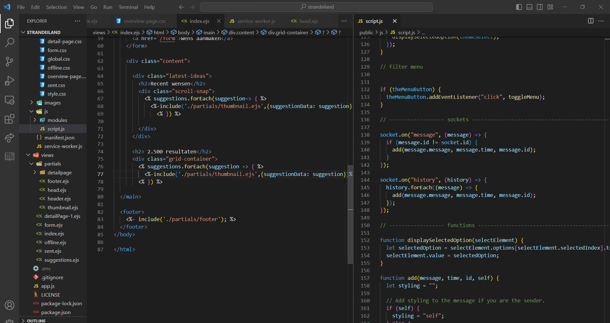

# Meesterproef - Duurzaam, groen en sociaal Strandeiland

- Team Repo: https://github.com/RainbowJM/strandeiland

---
## Inhoudsopgave
- [Meesterproef - Duurzaam, groen en sociaal Strandeiland](#meesterproef---duurzaam-groen-en-sociaal-strandeiland)
  - [Inhoudsopgave](#inhoudsopgave)
  - [Week 1: Debriefing en de eerste iteratie](#week-1-debriefing-en-de-eerste-iteratie)
  - [Opdrachtomschrijving](#opdrachtomschrijving)
  - [User stories](#user-stories)
  - [Voor de briefing](#voor-de-briefing)
    - [Mindmap](#mindmap)
  - [De briefing](#de-briefing)
- [Ideegeneratie](#ideegeneratie)
  - [Requirements lijst en brainstorm sessie](#requirements-lijst-en-brainstorm-sessie)
  - [Visuele analyse](#visuele-analyse)
  - [Schetsen overzichtpagina's](#schetsen-overzichtpaginas)
  - [Iteratie 1 - Overzichtpagina eerste versie op Figma](#iteratie-1---overzichtpagina-eerste-versie-op-figma)
    - [Versie 1:](#versie-1)
    - [Versie 2:](#versie-2)
  - [Iteratie 2: Overzichtpagina op code](#iteratie-2-overzichtpagina-op-code)
    - [Versie 1:](#versie-1-1)
    - [Versie 2:](#versie-2-1)
- [Feedback week 1](#feedback-week-1)
  - [31 mei 2023: Feedback design review](#31-mei-2023-feedback-design-review)
  - [1 juni 2023: Feedback debriefing](#1-juni-2023-feedback-debriefing)
  - [2 juni 2023:  Testen met opdrachtgever iteratie 1 -](#2-juni-2023--testen-met-opdrachtgever-iteratie-1--)
  - [Reflectie](#reflectie)
  - [Wat gaan we volgende week doen?](#wat-gaan-we-volgende-week-doen)
  - [Week 2: Filter functionaliteit, Code review en feedback](#week-2-filter-functionaliteit-code-review-en-feedback)
    - [Wat ik heb gedaan deze week](#wat-ik-heb-gedaan-deze-week)
  - [Filter schetsen variaties](#filter-schetsen-variaties)
  - [Themas](#themas)
  - [Filter design op Figma](#filter-design-op-figma)
  - [Filter component op code](#filter-component-op-code)
  - [Code Opsplitsen in modules](#code-opsplitsen-in-modules)
  - [Code review - 7 Juni 2023](#code-review---7-juni-2023)
  - [Opdrachtegver feedback - 9 juni 2023](#opdrachtegver-feedback---9-juni-2023)
- [Week 3: Nieuwe detailpagina design, chat, filter en feedback](#week-3-nieuwe-detailpagina-design-chat-filter-en-feedback)
  - [Wat heb ik gedaan:](#wat-heb-ik-gedaan)
    - [Uitegbereide filter functionaliteit](#uitegbereide-filter-functionaliteit)
  - [Nieuwe wens detailpagina design](#nieuwe-wens-detailpagina-design)
  - [Nieuwe chat design](#nieuwe-chat-design)
    - [Data fetchen op de overzichtpagina](#data-fetchen-op-de-overzichtpagina)
    - [Code snippets](#code-snippets)
    - [Toegankelijkheid testjes](#toegankelijkheid-testjes)
    - [Kleur contrast voor de kleurpallette](#kleur-contrast-voor-de-kleurpallette)
    - [Blauw en wit](#blauw-en-wit)
    - [Pastel Blauw en zwart](#pastel-blauw-en-zwart)
    - [Geel en Zwart](#geel-en-zwart)
    - [Pastel geel en zwart](#pastel-geel-en-zwart)
      - [Responsive](#responsive)
    - [Code review - 14 Juni 2023 met Joost](#code-review---14-juni-2023-met-joost)
    - [Opdrachtgever feedback - 15 Juni 2023](#opdrachtgever-feedback---15-juni-2023)
    - [Design review - 15 Juni 2023 met Sanne](#design-review---15-juni-2023-met-sanne)
  - [Nieuwe kleurpallette](#nieuwe-kleurpallette)
  - [Iteratie 3 - Nieuwe overzichtpagina Design op Figma](#iteratie-3---nieuwe-overzichtpagina-design-op-figma)
    - [Nieuwe thumbnails design](#nieuwe-thumbnails-design)
    - [Wat ga ik voor volgende week doen?](#wat-ga-ik-voor-volgende-week-doen)
  - [Reflectie van week 3](#reflectie-van-week-3)
- [Week 4:](#week-4)
    - [Wat heb ik deze week gedaan?](#wat-heb-ik-deze-week-gedaan)
  - [Iteratie 4 - Nieuwe herontwerp voor de overzichtpagina](#iteratie-4---nieuwe-herontwerp-voor-de-overzichtpagina)
  - [Thumbnails](#thumbnails)
  - [Ronde hoeken](#ronde-hoeken)
  - [Thumbnail hover state](#thumbnail-hover-state)
  - [Data ophalen vanuit de database en eromheen stijlen](#data-ophalen-vanuit-de-database-en-eromheen-stijlen)
  - [Thema per wens](#thema-per-wens)
  - [Aantal resultaten zien](#aantal-resultaten-zien)
  - [Laast gemaakte wensen met de data daarbij](#laast-gemaakte-wensen-met-de-data-daarbij)
  - [Slogan](#slogan)
    - [Responsiveness](#responsiveness)
  - [Microinteracties](#microinteracties)
  - [Filter met selectmenu](#filter-met-selectmenu)
    - [Kleine styling fixen bij de user pagina](#kleine-styling-fixen-bij-de-user-pagina)
    - [Code review - 21 Juni 2023 met Joost](#code-review---21-juni-2023-met-joost)
    - [Design review - 22 Juni 2023 met Vasilis](#design-review---22-juni-2023-met-vasilis)
    - [Opdrachtgever feedback - 23 Juni 2023](#opdrachtgever-feedback---23-juni-2023)
    - [Kleine css fix](#kleine-css-fix)
    - [Visualistatie van de thema's](#visualistatie-van-de-themas)
    - [Gesorteerde thema's](#gesorteerde-themas)
    - [Call to action](#call-to-action)
  - [Wishlist](#wishlist)
---

## Week 1: Debriefing en de eerste iteratie
Deze week begonnen we met een kick-off presentatie van het eindproject voor deze Minor. We kregen gedetailleerde informatie over het geplande schema voor de komende vijf weken. Verder hebben we een eerste iteratie aangewerkt van ons prototype. Voor deze week wilde we een eerste versie van de overzichtpagina, detailpagina maak een wens formulier. Ik ben aan de slag geweest met het uitwerken van de overzichtpagina. 

## Opdrachtomschrijving
Het bedrijf CrossmarX wil een nieuwe functionaliteit toevoegen voor de hallostrandeiland.nl website waar IJburg bewoners nieuwe voorstellen kunnen insturen voor de nieuwe wijk van Strandeiland. Hiermee wordt de communicatie tussen toekomstige bewoners van Strandeiland en de projectleiders van de gemeente Amsterdam bevorderd. Het doel is om via Hallo Strandeiland goede ideeën en voorstellen te verzamelen, te verbeteren en de mooie en haalbare ideeën/voorstellen gerealiseerd te krijgen. 

## User stories
> Als toekomstig bewoner, wil ik mijn voorstel voor een duurzamer, groener en socialer strandeiland kunnen delen, zodat dit onderzocht en hopelijk gerealiseerd kan worden.

> Als toekomstig bewoner, wil ik een reactie kunnen geven op voorstellen van andere toekomstige bewoners, zodat we kunnen samenwerken aan het vormgeven van de voorstellen.

> Als projectmanager van de gemeente, wil ik voorstellen van toekomstige bewoners kunnen filteren op thema's, zodat ik per thema kan bekijken of er ideeën bijzitten die kunnen bijdragen aan een lagere ecologische footprint, of betere sociale cohesie van de wijk.

## Voor de briefing
Verder hadden we een eerste ontmoeting met Michel Vogler van CrossmarX. Voordat we de briefing kregen hebben we een mindmap gemaakt met alle informatie die we al hadden over het project. Deze mindmap vind je hieronder.

### Mindmap


Hieronder vind je de vragen die we hebben gesteld aan Michel Vogler:
1. Wat wil de opdrachtgever met deze opdracht?
1. Eigen repo op github of repo van het bedrijf zelf? (vanuit school moet github)
1. Prototype start from scratch? 
1. Wat is de doelstelling?
1. Wat zijn de randvoorwaarden?
1. Heeft het project relatie met een andere project?
1. Voor desktop alleen? of desktop en mobile?
1. Hosten jullie het zelf?
1. Is er al een design? Is er een huisstijl? Is de huisstijl van de hello strandeiland?
1. Moet het een progressive web app worden? (zodat de app downloadbaar is)
1. Hoe moeten de voorstellen eruit komen te zien? Moet het een soort document worden of tekst met eventueel een afbeelding?
1. Hoe ziet u het onderdeel van de projectmanager voor zich? Bewoners en projectmanager een account of alleen projectmanager een account.
1. Zijn er specifieke thema’s, zoals lagere ecologische footprint en betere sociale cohesie van de wijk of moeten gebruikers deze zelf aan kunnen maken bij het voorstel?
1. Wanneer er meerdere voorstellen zijn geüpload, wilt u deze dan op een pagina zien waar u kunt filteren of onder verschillende tabbladen wilt met de verschillende thema’s?
1. In hoeverre verschilt dit project met hallostrandeiland.nl, aangezien je daar ook berichten hebt waar je een reactie bij kan plaatsen?
1. Hebben jullie het logo en beeldmateriaal, zodat wij dit kunnen gebruiken?

## De briefing
Na de briefing met de opdrachtgever hebben we een debriefing geschreven met ze allen en weer naar de opdrachtgever gestuurd. Hieronder is de link van ons debriefing.

- [https://github.com/RainbowJM/strandeiland/wiki/Debriefing](https://github.com/RainbowJM/strandeiland/wiki/Debriefing)

---
# Ideegeneratie
## Requirements lijst en brainstorm sessie


Hieronder zijn een aantal eisen die het product hebben:
- Er is een overzichtpagina waar gebruiker een overzicht van all wensen kan zien.
- Gebruikers kan filtreren op basis van populariteit, oudheid en thema.
- Gebruikers moeten zelf een voorstel kunnen aanmaken met behulp van wens maken formulier.
-  Het voorstel formulier opstellen op loclstorage
-  Een real time chat waar gebruikers met elkaar kunnen praten.


## Visuele analyse
Verder heb ik gewerkt aan de visuele analyse van de brand boek die we hadden gekregen van de opdrachtever. De reden waarom ik een visuel analyse heb gemaakt is omdat wij als groep een beeld kan krijgen welke beeldelementen moet we gebruiken op het protptype. Op de visuele analyse staan de volgende onderdelen:

- Typografie
- Kleurpalette en kleurcodes
- site componenten
- navigatiemenu
- call to action button

## Schetsen overzichtpagina's
Voor deze week zijn we begonnen met de idee generatie van het concept. Ik heb als taak gekregen om aan de slag te gaan met de overzichtpagina. Ik heb op mijn tekentablet, een paar schetsen gemaakt van de overzichtpagina. Hieronder staat een aantal schetsen die ik heb gemaakt van de overzichtpagina.


## Iteratie 1 - Overzichtpagina eerste versie op Figma
Daarna ben ik meteen begonnen  met de eerste uitwerking van de overzichtpagina op prototype

### Versie 1:
Dit is mijn eerste versie die ik op figma heb gemaakt. Ik heb eerste de navigatiemnu nagemaakt van de strandeiland website. Want de opdrachtgever zei dat we alleen een nieuwe pagina moet toevoegen. En niet from scratch beginnen. Verder hebben we een slogan bedacht voor de wensen pagina, om het wat aantrekkelijker te maken. De layout hier is een grid van twee kolommen. En helemaal aan de rechterkan staat een onderdeel met de recente gemaakte wensen. Dus het wordt ook real time bijgehouden. 


### Versie 2:
In de tweede figma versie, heb ik andere layou stijl gemaakt. Bovenaan heb je een slideshow met populaire wensen. Maar de opdrachtgever gaf als feedback dat als je de populairste wensen bovenop zet worden ze populairder altijd on top en andere wensen worden in de achtergrond gebleven. Hij wil dat alle wensen gelijke kansen krijgen. 


## Iteratie 2: Overzichtpagina op code
Na het ontwerpen op Figma, ben aan de slag gegaan met de code. Ik heb mijn eerste versie op een aparte branch gemaakt. Hieronder kun je de verschillende iteraties zien die ik heb gemaakt op de overzichtpagina. 

### Versie 1:


### Versie 2:


---
# Feedback week 1

## 31 mei 2023: Feedback design review
- Meer interactie geven
- Meer afwijken van de huisstijl
- Overleg of de chat echt nuttig is
- Elk thema een kleur geven
- De detailpagina met bepaalde thema een kleur geven
- Animatie bij de slogan

## 1 juni 2023: Feedback debriefing 
We hebben ons eerste versie van de debrief gestuurd aan ons coach en de opdrachtgever. We hebben feedback gekegen die we hebben samen aangepast. Hier is de nieuwe versie van de debriefing:

Hier is een lijst met de feedback:
- Hebben we toegang tot het platform CrossMarX? Is dat nodig? 
- Is er content/data beschikbaar?
- Hoe gaan IJburg bewoners op het platform? Voornamelijk Mobiel? Responsive?
- Hoe krijgt de gemeente en projectleiders de ideeen en voorstellen te zien/horen?
- Hebben we een huisstijldocument? Of moeten we dat samenstellen aan de hand van de bestaande website
- Is de huisstijlgids grafisch of zijn er al web elementen en componenten gedefinieerd (living styleguide)?
- Kunnen we inlog testen? Hebben we test user accounts? Is dat nodig?
- Hebben we toegang tot de gebruikers? Testdagen plannen? (liefst door de opdrachtgever)
- Projectleiders ontbreken in de lijst gebruikers?
- Welke data kunnen/willen de bewoners posten? titel, text, categorie, platje, filmpje? 
- Wat betekent API (vanuit school)? Wie gaat dat doen?
- Ik zie niet goed wat de relatie is tussen het project wat jullie gaan ontwerpen en maken en de CrossmarX software


## 2 juni 2023:  Testen met opdrachtgever iteratie 1 -
- We kunnen de thema bepalen met sustainability development goals of Donut economics
- Andere woorden voor trekkers en delers kunnen zijn; ambassadeur, steunen
- Overzicht van de mensen die de voorstel delen
- Kan wel met de huisstijl afwjken, moet wel strandeland gevoel uiten
- Kan je zien wie online is in de chat
- beetje ingewikkeld over chat, het kan misschien te veel worden, hij wilt echt de belangrijke berichten terug zien.
- meerdere thema's kunnen selecteren in het formulier
- hij wilt de chat zien en ook berichten zien (belangrijke berichten)
- aparte pagina maken waar je de chat apart op een pagina zet
- thema's moeten geod bekeken worden, strandeiland bestaat nog niet, dus speeltuin etc gaat niet handig zijn
- alle dingen die fout gaan op dit moment, die kun je vooraf voorkomen, zulke wensen wilt hij zien


## Reflectie
Deze week is voorbij, we hebben een debrief geschreven en al aan de opdrachtgever gestuurd. Verder heb wel op senlle manier iets samengesteld zodat wij aan de opdrachtgever kon presenteren. Ik moet wel zeggen dat ik mischien meer tijd moet besteden aan het schetsen van bepaalde functionaliteiten, om wat variaties toe te brengen. Verder denk ik wel dat we een beetje uniform moet werken qua code, want iedereen heeft een andere stijl. Dus volgende week ga ik een voorstel geven om linters te gebruiken. 

Verder denk ik wel dat wij als groep goed samenwerken, en er is duidelijke communicatie en taakverdeleling. oor volgende week moeten we bespreken welke nieuwe dingen willen we leren. Want tot nu toe doen we allemaal wat we al goed in bent. 


---

## Wat gaan we volgende week doen?
- filter menu afmaken
- wens maken button aanmaken
- schetsen maken van de filter
- schetsen maken van ui stack
- reflectie schrijven

---
## Week 2: Filter functionaliteit, Code review en feedback 
In deze week hadden we een ons eerste standup met de coach. Hier besproken we wat we allemaal de vorige week hebben gedaan. We hebben aan hem verteld wat voor week 2 gaat doen en hoe we moeten het aanpakkken. Verder hadden we deze week onze eerste individueel code review en uiteindelijk onze tweede iteratie presenteren aan de opdrachtgever.

### Wat ik heb gedaan deze week
- Design gemaakt voor de filter functieop Figma
- Fouten fixen op wens aanmaken formulier
- Filter bouwen met HTML, CSS en JavaScript
- Code refactoren en schoonmaken
  
## Filter schetsen variaties 
Ten eerste heb ik opgezocht naar verschillende manieren waar het filter componenet gemaakt kan worden. Daarna heb ik de beste  ideeën op papier geschets. Ik probeerde veel variaties in te brengen om meer ideeen te generen. Voor de prototype willen een filter functionaliteit kan toevoegen zodat de gebruikers de wensen kan filteren op basis van de thema's en ook sorteren op meest recent, meest gedeeld, meeste trekkers en meeste helpers. WDe gekozen filter criterias worder onderaan terug te zien.


## Themas
Voordat ik het filter functionaliteit kon implementeren in het prototype hebben we de thema's samen vastgesteld. Hironder kunnen jullie de thema's terugzien.


## Filter design op Figma

Wanneer ik een concrete idee, ben ik naar figma gegaan om een design te maken aan de filter functionaliteit. Ik maakte een design op Figma want dan is de overstap  van idee naar code makkelijker. 

Op Figma heb ik een component gemaakt voor het filteren op thema's. Ik heb de component gemaakt voor mobiel en op grotere schermen. Voor kleiner schermen heeft filteren twee kolommen. Voor grote schermen heeft de filter drie kolommen. 

Daarma hen ik twee variaties gemaakt. De eerste variatie hebben de filter items ook een checkbox die je kan aanvinken. De andere variatie heeft geen checkbox, hier moet je gewoon klikken. 
Als je op een van de checkboxes klikt verandert de achtergrond van de filter items. Ik heb twee variaties, eentje is met een zwarte achtergrond en de andere is met een blauwe achtergrond. 

## Filter component op code


<details>
<summary><h2>Filter code</h2></summary>

```html
    <form>
      <fieldset>
        <button class="close-filter">Close filter</button>
        <ul>
          <li class="theme-btn" data-filter-target="#theme">
            <span> <b>Filtreren op:</b></span>
            <span>Thema <i class="fa-solid fa-angle-down"></i></span>
          </li>
          <li class="sort-btn" data-filter-target="#sorting">
            <span>Sorteren op:</span>
            <span>Meest recente <i class="fa-solid fa-angle-down"></i></span>
          </li>
          <li>
            <span>Zoek op trefwoord</span>
          <label for="search">
            <i class="fa-solid fa-magnifying-glass" style="color: #000000;"></i>
            <input type="text" name="search" id="search" placeholder="Zoek op treftwoord">
          </label>
          
          </li>
        </ul>

        <section class="filter-content">
          <article id="theme" data-filter-content>
            <ul class="theme-filter-items"> 
              <li><label><input type="checkbox" name="theme" value="sport"><span>Sport</span></label></li>
              <li><label><input type="checkbox" name="theme" value="recreatie"><span>Recreatie</span></label></li>
              <li><label><input type="checkbox" name="theme" value="verkeer"><span>Verkeer</span></label></li>
              <li><label><input type="checkbox" name="theme" value="Winkels"><span>Winkels</span></label></li>
              <li><label><input type="checkbox" name="theme" value="natuur"><span>Natuur</span></label></li>
              <li><label><input type="checkbox" name="theme" value="milieu"><span>Milieu</span></label></li>
              <li><label><input type="checkbox" name="theme" value="jeugd"><span>Jeugd</span></label></li>
              <li><label><input type="checkbox" name="theme" value="veiligheid"><span>Veiligheid</span></label></li>
              <li><label><input type="checkbox" name="theme" value="cultuur"><span>Cultuur</span></label></li>
              <li><label><input type="checkbox" name="theme" value="huisvesting"><span>Huisvesting</span></label></li>
              <li><label><input type="checkbox" name="theme" value="infrastructuur"><span>Infrastructuur</span></label></li>
              <li><label><input type="checkbox" name="theme" value="strand"><span>Strand</span></label></li>
              <li><label><input type="checkbox" name="theme" value="onderwijs"><span>Onderwijs</span></label></li>
              <li><label><input type="checkbox" name="theme" value="overig"><span>Overig</span></label></li>
            </ul>
            <button class="filter-theme-results-btn" type="submit">Toon resultaten</button>
          </article>

          <article id="sorting" data-filter-content>
            <ul class="sorting-filter-items">
              <li><label><input type="radio" name="sort" value="recent"><span>Meest Recente</span></label></li>
              <li><label><input type="radio" name="sort" value="delers"><span>Meest gedeeld</span></label></li>
              <li><label><input type="radio" name="sort" value="trekkers"><span>Meeste trekkers</span></label></li>
              <li><label><input type="radio" name="sort" value="helpers"><span>Meeste helpers</span></label></li>
            </ul>

            <button class="filter-sort-results-btn" type="submit">Toon resultaten</button>
          </article>
        </section>
        <p class="selected-filter-items">Hello</p>
      </fieldset>
      <a href="/form">Maak een wens!</a>
    </form>

```

</details>

## Code Opsplitsen in modules
Een van de feedbak van de code review die ik heb verwerkt is het refatoren van de code in Module. Ik was aan de gang gegaan met het refactoren. Wat ik heb gedaan heb ik bij de script tag de `type="module` gegeven. Met deze aanpassing activeer ik de mogelijkheid om mijn javascript code in modules te schrijven. Ten eerste heb ik een modules bestandmap gemaakt. In de module map heb ik per functie/componenten in een aparte javascript bestand geplaatst. Daarna exporteer ik z naar de hoofd javascript bestand met `export {...}` en in de `script.js` imorteer ze met `import`.



## Code review - 7 Juni 2023
Op  7 juni hebben we een individuele code review met docenten. Ik had code review gedaan bij robert. Ik heb geen nuttige feedback gekregen over mij code. Maar een ander Teamlid heeft heel veel nuttige feedback gekregen. Hier is een lijst van de feedback:
- Branch per functionaliteiten maken
- Issues aanmaken en linken in de projectboard
- Github gebruiken om een to do lijst bij te houden 
- Javascript en ejs templating opspliten en in modules herschrijving.


## Opdrachtegver feedback - 9 juni 2023
- Duidelijker maken dat de filter kun je uitklappen.
- Treftwoord opzoeken. 
- Nieuwe design voor detailpagina
- Niuewe design voor de chat- meer functonaliteiten en de naam veranderen
- Verschillende manieren om afbeeling in wens aan formulier te uploaden
- Voorstel veranderen in wens
- Trekkers menu anders doen en niet aan de zijkant
- De wens aanmaken buton moet een activerend call to action hebben
 

---
# Week 3: Nieuwe detailpagina design, chat, filter en feedback
Ik ben halverwege de meesterproef er zijn nog twee weken te gaan voor de expo. DEze week heb ik veel feedback gekregen van de opdrachtgever en tijdens de code en design review met Sanne en Joost. Verder heb ik verder gewerkt aan de filter functionaliteit, de nieuwe detailpagina en chat figma prototype. 

## Wat heb ik gedaan:
- De filter dropdown menu duidelijker maken dat het een dropdown menu is
- Duidelijker maken wat of het filteren of sorteren is
- De aanmaak wens button een activerende call to action geven
- Een nieuwe chatdesign gemaakt op Figma
- Geholpen met het ontwerpen van de detailpagina  
- Data vanuit supabase opgehaald en op de overzichtpagina weergeven
- Nieuwe design voor de detailpagina

### Uitegbereide filter functionaliteit


Ik heb verder gewerkt aan de filter functionaliteit. Tijdens het gesprek van de opdrachtgever, heeft hij aangegeven dat interactie van de dropdownmenu duidelijker moet zijn.  Om de interactie wat duidelijker te maken heb ik een pijl icoon gebruikt van fontawesome. Ik heb fontawesome gebruikt omdat je kan makkelijk implementeren in code met een `<i>` element. 

Verder heb ik meer context gegeven wat voor soort filter het is. Ik heb een label toegevoegd met de tekst "Filter op" en "Sorteren op".

<details>
<summary><h2>Filter code</h2></summary>

```html
    <form>
      <fieldset>
        <button class="close-filter">Close filter</button>
        <ul>
          <li class="theme-btn" data-filter-target="#theme">
            <span> <b>Filtreren op:</b></span>
            <span>Thema <i class="fa-solid fa-angle-down"></i></span>
          </li>
          <li class="sort-btn" data-filter-target="#sorting">
            <span>Sorteren op:</span>
            <span>Meest recente <i class="fa-solid fa-angle-down"></i></span>
          </li>
          <li>
            <span>Zoek op trefwoord</span>
          <label for="search">
            <i class="fa-solid fa-magnifying-glass" style="color: #000000;"></i>
            <input type="text" name="search" id="search" placeholder="Zoek op treftwoord">
          </label>
          
          </li>
        </ul>

        <section class="filter-content">
          <article id="theme" data-filter-content>
            <ul class="theme-filter-items"> 
              <li><label><input type="checkbox" name="theme" value="sport"><span>Sport</span></label></li>
              <li><label><input type="checkbox" name="theme" value="recreatie"><span>Recreatie</span></label></li>
              <li><label><input type="checkbox" name="theme" value="verkeer"><span>Verkeer</span></label></li>
              <li><label><input type="checkbox" name="theme" value="Winkels"><span>Winkels</span></label></li>
              <li><label><input type="checkbox" name="theme" value="natuur"><span>Natuur</span></label></li>
              <li><label><input type="checkbox" name="theme" value="milieu"><span>Milieu</span></label></li>
              <li><label><input type="checkbox" name="theme" value="jeugd"><span>Jeugd</span></label></li>
              <li><label><input type="checkbox" name="theme" value="veiligheid"><span>Veiligheid</span></label></li>
              <li><label><input type="checkbox" name="theme" value="cultuur"><span>Cultuur</span></label></li>
              <li><label><input type="checkbox" name="theme" value="huisvesting"><span>Huisvesting</span></label></li>
              <li><label><input type="checkbox" name="theme" value="infrastructuur"><span>Infrastructuur</span></label></li>
              <li><label><input type="checkbox" name="theme" value="strand"><span>Strand</span></label></li>
              <li><label><input type="checkbox" name="theme" value="onderwijs"><span>Onderwijs</span></label></li>
              <li><label><input type="checkbox" name="theme" value="overig"><span>Overig</span></label></li>
            </ul>
            <button class="filter-theme-results-btn" type="submit">Toon resultaten</button>
          </article>

          <article id="sorting" data-filter-content>
            <ul class="sorting-filter-items">
              <li><label><input type="radio" name="sort" value="recent"><span>Meest Recente</span></label></li>
              <li><label><input type="radio" name="sort" value="delers"><span>Meest gedeeld</span></label></li>
              <li><label><input type="radio" name="sort" value="trekkers"><span>Meeste trekkers</span></label></li>
              <li><label><input type="radio" name="sort" value="helpers"><span>Meeste helpers</span></label></li>
            </ul>

            <button class="filter-sort-results-btn" type="submit">Toon resultaten</button>
          </article>
        </section>
        <p class="selected-filter-items">Hello</p>
      </fieldset>
      <a href="/form">Maak een wens!</a>
    </form>

```
</details>


## Nieuwe wens detailpagina design
Verder gingen we als groep aan de slag met herontwerpen van de detailpagina van een wens. We hebben een aantal iteraties gemaakt op Figma en uiteindelijk hebben we een design gekozen. Hilal ging het pagina uitwerken in code We hebben de hoogtepunten van een reacties verwijdert en in plaats daarvan de trekkers, helpers en delers wat meer ruimtes gegeven. Omdat de delers misschien te groot kan zijn hebben we besloten om de om alleen de profielfoto te laten zien, dan wordt het makkelijker om meer delers naast elkaar te laten zien. Als je de naam van de deler wilt zien kan je op de profielfoto klikken. Dan komt een kleine popup met de naam van de deler.

We hebben hier ook een beetje gespeeld met de kleur. Aan de rechterkant hebben we  een achtergrondkleur toegevoegd om een beetje wat kleurrijk te maken tussean al de witte vlakken.

Als laaste kreeg de Chat een herontwerp, want de opdrachtgever zag geen toegevoegde waarde in een chat dus we hebben de interface verandert die meer lijkt reactie functionaliteit. In het volgende onderdeel ga ik meer vertellen over de chat. 


## Nieuwe chat design
Zoals ik al zei, we wilden een chat implementeren in de detailpagina zodat mensen op wensen reageren. Maar de opdrachtgever zag geen toegevoegde waarde in een chat. Hij chat als whatsapp dus iets informeel. Daardoor hebben we de naam verandert naar reacties. Ook hebben we besloten om meer functionaliteit te implementeren:
- Bekijken hoeveel reacties er zijn:
- Reageren op een reactie
- Reactie kunnen lijken
- Bekijken wie online is
- Kijken wie aan het typen is.
- Datum wanneer het geplaatst is


Met de nieuwe functionalieiten klinkt het meer formeel dan alleen een simpel chat.

### Data fetchen op de overzichtpagina
Het volegnde stap was de dynamische content in de website te implementeren. In de laaste drie weken hebben we een alleen gewerkt met hardcoded en startische data om zich te focussen op de over de opmaak van de pagina.  

Om de data te halen gebruiken we supabase. Jevona heeft dan een API gemaakt met behulp van supabase. We hebben een paar endpoints gemaakt om de data te fetchen. 

Hier is een datamodel die Jevona heeft gemaakt, hoe de structuur van de data eruit ziet.


Voor de wens overzichtpagina had ik de suggestion endpoint nodig om informatie van de wensen te weergeven. In de endpoint staat informatie zoals:
- titel van de wens 
- beschrijving van de wens
- Aantal reageerders en trekkers
- Datum wanneer het gemaakt is  
- afbeelding van de wens


In deze foto kun je zien, hoe de data wordt weergeven op de overzichtpagina. Ik moet het nog een beetje stylen, maar het is een begin. 

### Code snippets
Om de data te fetchen was het niet te moeilijk te doen. De data word server-side opgehaald. Wat ik heb gedaan is een tabel vanuit de supabase database halen en de data loopen in de template engine. 

Dus de wens kaarten heb ik eenmalig gemaakt in een partial bestand. De data wordt gestuurd naar de partial bestand en daarin worden de data weergeven. 

```js
// app.js

const { createClient } = require('@supabase/supabase-js');
const supabase = createClient(
    'https://yyufywjwwwmgfjmenluv.supabase.co',
    `${process.env.SUPABASE_KEY}`);


    
app.get("/",  async (req, res) => {
  const { data: themeData, themeError } = await supabase
    .from('theme')
    .select()

  const { data: suggestionsData, error: suggestionsError } = await supabase
    .from('suggestion')
    .select()
  console.log(suggestionsData)

  res.render("index", {
    title: "Wensen",
    themes: themeData,
    suggestions: suggestionsData
  });
});
```
Wat ik deed was de tabel selecteren met de supabase client met `.from`. Daarna  heb ik de data gestuurd naar de template engine als een object. 


```html
<!-- index.ejs -->

<div class="grid-container">
  <% suggestions.forEach(suggestion => { %>
    <%-include('./partials/thumbnail.ejs',{suggestionData: suggestion})%>
  <% }) %>

</div>
```

```html
<!-- /partials/thumbnail.ejs -->
<section class="thumbnail-container">
    <figure>
        <h2>hey</h2>
        <div class="image-container">

             " alt="Vanuit het natuur">
        </div>
        <figcaption>
            <%= suggestionData.thema%>
        </figcaption>
    </figure>


    <a href="/detailpage-1">

        <article>

            <ul class="user-info">
                <li>Pieter van der baas</li>
                <li>
                    <%= suggestionData.created_at %>
                </li>
            </ul>

            <h2>
                <%= suggestionData.title %>
            </h2>
            <p>
                <%= suggestionData.description %>
            </p>

            <ul class="statistics">
                <li><span>Reaction:</span>
                    <%= suggestionData.reaction %>
                </li>
                <li> <span> Delers:</span>
                    <%= suggestionData.amount_vote%>
                </li>
            </ul>
        </article>
    </a>

</section>

```

### Toegankelijkheid testjes
Ik heb af en toe een paar toegankelijkheid testen gedaan om het prototype toegankelijker te maken. Omdat het doelgroep voor dit website heel groot is moeten we ervoor zorgen dat de website toegankelijk zijn voor iedereen. 

Ik heb daardoor een aantal testen gedaan om te kijken of de kleurcontrasten tussen de tekt en de achtergrond goed zijn. Ook heb ik gekeken  hoe de website te bedienen is op mobiel.

###  Kleur contrast voor de kleurpallette

### Blauw en wit
Ik heb hier de blauwe kleur van de kleurpallette met de wit getest. De contrast ratio is 3.1:1. Dit is niet genoeg voor kleine teksten maar wel voor grote teksten zoals titels en subtitels.


### Pastel Blauw en zwart
Hier heb ik de pastel blauwe kleur van de kleurpallette met de zwarte kleur getest. De contrast ratio is 14.3:1. Dit is genoeg voor kleine teksten en grote teksten.


### Geel en Zwart
Hier heb ik de felle gele kleur van de kleurpallette met de zwarte kleur getest. De contrast ratio is 16.7:1. Dit is genoeg voor kleine teksten en grote teksten.


### Pastel geel en zwart
Hier heb ik de pastel gele kleur van de kleurpallette met de zwarte kleur getest. De contrast ratio is 16.3:1. Dit is genoeg voor kleine teksten en grote teksten.


#### Responsive 

### Code review - 14 Juni 2023 met Joost
- De code is goed gestructureerd en overzichtelijk.
- De app.js beter gaan opschonen en splitsen in meerdere bestanden


### Opdrachtgever feedback - 15 Juni 2023
Een paar feedback punten vanuit de opdrachtgever zijn:
- Het sorteren functie moet  onderscheid worden van de filter functie. 
- Online weergaven op het bericht, is het iedereen die online is op de community pagina of zijn alleen gebruikers die op dit moment op de pagina bevinden. 
- Groene cirkel (wanneer de gebruiker online is) is niet duidelijk genoeg
- Een paar feedback punten die we van de docenten hebben gekregen
Bij het formulier pagina moet er op hierachie gelet worden welke componenten horen bij elkaar
-  Ook bij het formulier pagina kan de sectie van afbeelding naar een pop up verandert worden.
- De hierarchie van de overzichtspagina letten
- Een pakkende afbeelding voor de banner op de overzichtspagina veranderen 


### Design review - 15 Juni 2023 met Sanne 
- Een pakkende banner afbeelding die meer context geeft.
- Meer spelen met het layout van de overzichtpagina's
- Meer kleur tintne toevoegen aan de kleurpalette


## Nieuwe kleurpallette 
Na de design review hebben we veel opmerkingen gekregen dat website heel saai is en lijkt als een standaard nieuwswebsite. We hebben daardoor als tip gekregen om de kleurpalette uit breiden met meer kleurtinten zoals we meer ruimte krijgen om de te spelen met de kleuren.  


## Iteratie 3 - Nieuwe overzichtpagina Design op Figma


### Nieuwe thumbnails design


### Wat ga ik voor volgende week doen?
- De nieuwe kleurpallette implementeren in de  wens overzichtpagina 
- De nieuwe layout van de overzichtpagina  in code verwerken.
- De themas toevoegen per wens
- Data filtreren op de overzichtpagina
- Meer microinteracties toevoegen in de wens overzichtpagina

## Reflectie van week 3
Deze week hebben we veel feedback gekregen, dat ik een gevoel krijgt dat we weer naar 0 zijn gegaan. Deze week heb ik mijn tijd besteed aan de filter en de overzichtspagina. Verder heb ik de data vanuit de database opgehaald en op de overzichtspagina geplaatst. We hebben veel feedback gekregen vanuit het design en code review. In de code review krijgen we als feedback om dynamische data toe te voegen, want het was een van ons core functionaliteiten. Bij de designview kreeg ik als feedback om de overzichtspagina wat creatieve onderdelen inzetten, want het zag er saai uit.  Na de designreview heb ik een nieuw design gemaakt voor de overzichtspagina op Figma. En aantal iteraties gemaakt en samen besproken. Voor de code review heb ik weer data  in de applicatie toegevoegd.

--- 
# Week 4:
Deze week is de vierde week van de meesterproef. Deze week heb ik verschillende dingen qua design met css als de backend zoals data vanuit de database ophalen. Verder had ik weer een code review en design review met docenten. Ik heb de overzichtspagina opnieuw ontworpen en meteen in code verwerkt. Ik heb daarbij nog wat kleine animaties toegevoegd zodat het wat soepeler blijft en als laatste heb ik nog met nieuwe css technieken geëxperimenteerd.

### Wat heb ik deze week gedaan?
- De nieuwe kleurpallette implementeren in de  wens overzichtpagina
- Nieuwe layout van de overzichtpagina  in code verwerken.
- De themas toevoegen per wens
- Dynamische data toevoegen
- Microinteracties toevoegen in de wens overzichtpagina
- Design review
- Skeleton screen toevoegen


## Iteratie 4 - Nieuwe herontwerp voor de overzichtpagina
Na de design review heb ik feedback gekregen om de pagina wat aantrekkelijker te maken. Ten eerste wanneer je op de pagina komt, zie je een afbeelding en de slogan. Maar het geef geen context wat de webpagina is. Verder de wens onderdeel paste niet echt bij de rest van de pagina. Het was helemaal saai. Hieronder ga ik uitleggen hoe ik de feedback heb verwerkt. 

## Thumbnails


## Ronde hoeken
Ten eerste heb ik de thumbnails ronde hoeken gegeven met` border-radius: 2em.` WIj wilde zeg maar de wens thumbnails een beetje laten lijken op een kaartje. Dus ik heb een `<article>` element met daarin de wens titel, de thema en kleine beschrijving van de wens. De article element heb ik ook een ronde hoek gegeven en met `transform translateY` heb ik de  element een beetje naar boven verplaatst zodat het op de afbeelding komt te staan.

Voor de afbeelding heb ik omgeringd met een `<figure>` element met een afmeting zodat alle afbeelding dezelfde afmetingen krijgen.  

```css
.grid-container .thumbnail-container figure {
  height: 15.625em;
}

.grid-container .thumbnail-container figure img {
  height: 100%;
  width: 100%;
  object-fit: cover;
}

/* Article element */
.grid-container .thumbnail-container article {
  width: 100%;
  transform: translateY(-18%);
  transition: transform .5s ease-in-out;
}

.grid-container .thumbnail-container article:hover {
  transform: translateY(-38%);
}
```

## Thumbnail hover state


Wanneer je met je muis over de thumbnail gaat, zie je dat de article element een beetje naar boven gaat. Dit heb ik gedaan met `transform: translateY(-38%);` en `transition: transform .5s ease-in-out;`.

Om het paragraaf een beetje te laten vervagen heb ik een ::before psuedo selector op de paragraaf gebruikt en een transparante gradient toegevoegd. 

```css
.thumbnail-container article p {
  position: relative;
  height: 8em;
  overflow: hidden;
}

.thumbnail-container article p::before {
  content: "";
  width: 100%;
  height: 100%;
  position: absolute;
  top: 0;
  left: 0;
  background: linear-gradient(transparent 10px, white);
}

```

## Data ophalen vanuit de database en eromheen stijlen
Vorige week heb ik al de data vanuit de database opgehaald maar het was nog niet compleet. Er miste nog de thema die bij de wens hoort. Dus ik heb de thema ook toegevoegd. Dus de data dat dynamsich zij:
Iteratie 2:
- De titel van de wens
- De thema van de wens
- De beschrijving van de wens
- De afbeelding van de wens
- De datum die daarbij hoort.

Zoals ik al eerder heb benoemd, we gebruiken de supabase database waar de wensen worden opgeslagen. De wensen worden gemaakt via de wens formulier en de data wordt dan gestuurd naar de database. 
Ik haal de data op via de server side met expres.js. Daarna wordt de data weergegeven op de overzichtspagina.

Hieronder zie je de code, hoe ik de data uit supabase ophaalt. Ten eerste maak ik twee variabele met daarin de data object en de error object. Verder gebruik ik de `.from()` methode om de tabel ye kiezen waar de data in zit. Daarna gebruik ik de `.select()` methode om de kolommen te kiezen die ik wil hebben. In dit geval wil ik de titel, thema, beschrijving en de afbeelding hebben. Omdat ik alles in de tabel wil hebben blijft die leeg. 

  En als laatste stuur ik de data mee naar de template engine ejs , om data te renderen op de pagina.

```js
  const { data: suggestionsData, error: suggestionsError } = await supabase
    .from("suggestion")
    .select();

      res.render("index", {
      title: "Wensen",
      themes: themeData,
      suggestions: shuffledSuggestionsData,
    });
```


## Thema per wens 
Wanneer je een wens aanmaak kun je meerdere thema meegeven. In de vorige iteratie waren de themas hardcoded op de overzichtpagina's. Maar ik en Jevona hebben besloten om de themas dynamisch te maken. Wat ik doe is, ik haal data vanuit de thema en de wensen tabel. Daarna kijk ik of de thema id overeenkomt met de thema id van de wens. Als dat zo is dan voeg ik de thema toe aan de wens object. En de data wordt daarna weergegven op de overzichtspagina.
```js
 const { data: themeData, themeError } = await supabase.from("theme").select();
  const { data: themeSuggestions, themeSuggestionsError } = await supabase
    .from("suggestion_theme")
    .select();
  const { data: suggestionsData, error: suggestionsError } = await supabase
    .from("suggestion")
    .select();

    for (const suggestion of suggestionsData) {
    const relatedTheme = themeSuggestions.find(
      (ts) => ts.suggestionId === suggestion.id
    );
    if (relatedTheme) {
      const theme = themeData.find((t) => t.id === relatedTheme.themaId);
      if (theme) {
        suggestion.theme = theme;
      }
    }
  }

   res.render("index", {
      title: "Wensen",
      themes: themeData,
      suggestions: suggestionsData,
    });


```

##  Aantal resultaten zien


Voor de gebruiker is het handig om te weten hoeveel wensen er zijn op de overzichtspagina. Dus ik heb een de `count` functie gebruikt waarbij elke item binnen de suggestion table array wordt geteld. 

```js
 const { count, error } = await supabase
    .from("suggestion")
    .select("*", { count: "exact", head: true });

```
Daarna stuur ik de `totalSuggestions` object mee naar de template engine ejs om het te renderen op de pagina.

```js
  res.render("index", {
      title: "Wensen",
      themes: themeData,
      suggestions: suggestionsData,
      totalSuggestions: count,
    });

``` 
Het ziet er zo uit op de pagina's:


## Laast gemaakte wensen met de data daarbij


In een van ons gesprek met de opdrachtgever heeft hij aangegeven dat hij wil niet de populaire wensen zien want dan blijven ze populair.En andere wensen hebben geen kans om naar voren te komen.  Dus wij dachten om in plaats daarvan de laatst gemaakte wensen te laten zien. Dan hebben nieuwe wensen ook een kans om naar voren te komen.
Hoe zie je dat de wensen nieuw zijn? Dat zie je aan de datum. De datum wordt ook opgeslagen in de database. Dus ik haal de datum op vanuit de database en ik sorteer de wensen op datum. De laatst gemaakte wensen komen dan bovenaan te staan. 

```js
  const { data: latestSuggestionsData, latestSuggestionsError } = await supabase
    .from("suggestion")
    .select()
    .order("created_at", { ascending: false })
    .limit(3);
```
Ik heb een kopie gemaakt van de wensen thumbnails html en in een nieuwe bestand geplaatst. 
Zodat ik de rest van de wensen niet verpest. Daarna in de server heb ik een nieuwe variabele gemaakt om data van de `suggestion` op te halen. Ik selecteer alles en ik sorteer de wensen op datum `.created_at` van nieuw naar oud. En ik gebruik de `.limit(3)` methode om de alleen drie laatst gemaakte wensen te laten zien. En als laatste stuur ik de data mee naar de template engine ejs om het te renderen op de pagina.

```js
  res.render("index", {
      title: "Wensen",
      themes: themeData,
      suggestions: suggestionsData,
      totalSuggestions: count,
      latestSuggestions: latestSuggestionsData,
    });

```

```html
<!-- index.ejs -->
 <h2>Bekijk de laatst gemaakte wensen</h2>
      <section class="latest-ideas">
        <% latestSuggestions.forEach(suggestion=> { %>
          <%-include('./partials/latest-thumbnail.ejs',{suggestion: suggestion})%>
            <% }) %>
      </section>

<!-- latest-thumbnails -->
      <li>
                    <%= (new Date(suggestion.created_at)).toLocaleString("nl-NL", {
      day: "numeric",
      month: "short",
      year: "numeric",
      hour: "2-digit",
      minute: "2-digit",
     
    })%>
                </li>
```


## Slogan
Deze onderdeel vindt 

- Wens aanmaken button verplaatst
- slogan beter uitgelijnd met de rest van de content

### Responsiveness
- Op mobiel 
- Op tablet
- Op desktop


## Microinteracties
De hover state op de skogav.
dropdown menu 


## Filter met selectmenu

- Sorteer verplaatst
- 

### Kleine styling fixen bij de user pagina


### Code review - 21 Juni 2023 met Joost
- De code is goed gestructureerd en overzichtelijk.
- Goede bestand benamingen 
- Console.log weghalen
- App.js opsplitsen in meerdere bestanden
- Performance test doen 
- Toegankelijkheid test doen
- Taken prioriteren

### Design review - 22 Juni 2023 met Vasilis
- De wens aanmaak knop een beetje laten draaien wanneer het gehoverd is.
- Probeer de selectmenu bij de filter.
- Grid auto fit gebruiken voor de thumbnails
- 

### Opdrachtgever feedback - 23 Juni 2023
We hebben nog meer feedback gekregen vanuit de opdrachtgever. Hieronder zie je de feedback die we hebben gekregen.
- Laat zien hoe de pagina eruit ziet wannneer de wens gesorteerd is bij thema's
- De call to action aanpassen naar iets anders zoals bijdragen naar een duurzaam sociaal en strandeiland.
- Laat een datavisualisatie zien welke themas het meest wordt gebruikt. 
- filter sorteren etc een stukje eronder onder de meest recente wensen plaatsen
- meer thema’s bij overzicht pagina op 1 wens
- max 3 thema’s in het formulier afdwingen
- bij overzichtpagina even kijken of we de afbeelding omdraaien of hem wat hoger maken.
- Of gewoon goed verwoorden waarom. -> titel is belangrijk
- filter visualiseren en niet in code
- die icoontjes op overzicht op 1 lijntje  overzichtpagina
- visualisatie hoe je kan zien welke themas het meeste voorkomen
- Wat niet heel erg naar voren komt is duurzaamheid en sociaal in de artikelen
in de oproep daarboven. Helpt mee om strandeiland zo duurzaam mogelijk te maken?
bij form u en uw veranderen naar jij en jouw


### Kleine css fix
- Wanneer er geen afbeelding wordt achtergrond kleur gegeven
- De offline error bericht centreren
- De foto's van de userpagina beter  stijlen

### Visualistatie van de thema's


### Gesorteerde thema's


### Call to action

## Wishlist
| Prioriteit | User story | Beschrijving | Status |
| :--- | :--- | :--- | :--- |
| 1 |  |  |  |