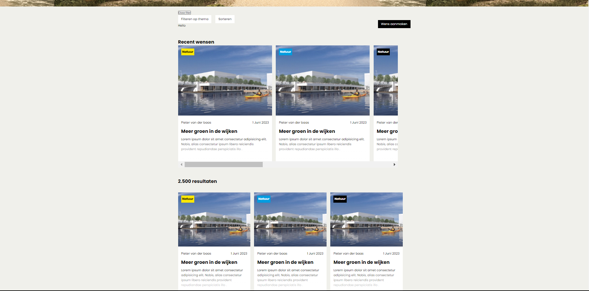
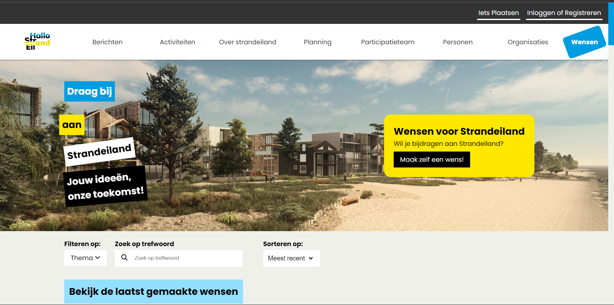
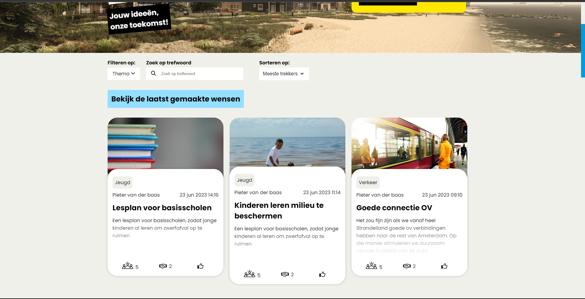
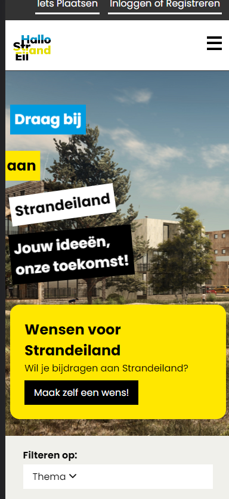

# [Meesterproef - Duurzaam, groen en sociaal Strandeiland](https://github.com/RainbowJM/strandeiland)

- Team Repo: https://github.com/RainbowJM/strandeiland

---
## Inhoudsopgave
- [Meesterproef - Duurzaam, groen en sociaal Strandeiland](#meesterproef---duurzaam-groen-en-sociaal-strandeiland)
  - [Inhoudsopgave](#inhoudsopgave)
  - [Week 1: Debriefing en de eerste iteratie](#week-1-debriefing-en-de-eerste-iteratie)
  - [Opdrachtomschrijving](#opdrachtomschrijving)
  - [User stories](#user-stories)
  - [Voor de briefing](#voor-de-briefing)
    - [Mindmap](#mindmap)
  - [De briefing](#de-briefing)
- [Ideegeneratie](#ideegeneratie)
  - [Requirements lijst en brainstorm sessie](#requirements-lijst-en-brainstorm-sessie)
  - [Visuele analyse](#visuele-analyse)
  - [Schetsen overzichtpagina's](#schetsen-overzichtpaginas)
  - [Iteratie 1 - Overzichtpagina eerste versie op Figma](#iteratie-1---overzichtpagina-eerste-versie-op-figma)
    - [Versie 1:](#versie-1)
    - [Versie 2:](#versie-2)
  - [Iteratie 2: Overzichtpagina op code](#iteratie-2-overzichtpagina-op-code)
    - [Versie 1:](#versie-1-1)
    - [Versie 2:](#versie-2-1)
    - [Scroll snap toegevoegd](#scroll-snap-toegevoegd)
- [Feedback week 1](#feedback-week-1)
  - [31 mei 2023: Feedback design review](#31-mei-2023-feedback-design-review)
  - [1 juni 2023: Feedback debriefing](#1-juni-2023-feedback-debriefing)
  - [2 juni 2023:  Testen met opdrachtgever iteratie 1 -](#2-juni-2023--testen-met-opdrachtgever-iteratie-1--)
  - [Reflectie](#reflectie)
  - [Wat gaan ik volgende week doen?](#wat-gaan-ik-volgende-week-doen)
- [Week 2: Filter functionaliteit, Code review en feedback](#week-2-filter-functionaliteit-code-review-en-feedback)
    - [Wat ik heb gedaan deze week](#wat-ik-heb-gedaan-deze-week)
  - [Filter schetsen variaties](#filter-schetsen-variaties)
  - [Themas](#themas)
  - [Filter design op Figma](#filter-design-op-figma)
  - [Filter component op code](#filter-component-op-code)
  - [Code Opsplitsen in modules](#code-opsplitsen-in-modules)
  - [Code review - 7 Juni 2023](#code-review---7-juni-2023)
  - [Opdrachtegver feedback - 9 juni 2023](#opdrachtegver-feedback---9-juni-2023)
  - [Coding Agreements](#coding-agreements)
- [Week 3: Nieuwe detailpagina design, chat, filter en feedback](#week-3-nieuwe-detailpagina-design-chat-filter-en-feedback)
  - [Wat heb ik gedaan:](#wat-heb-ik-gedaan)
    - [Uitegbereide filter functionaliteit](#uitegbereide-filter-functionaliteit)
  - [Nieuwe wens detailpagina design](#nieuwe-wens-detailpagina-design)
  - [Nieuwe chat design](#nieuwe-chat-design)
  - [Data fetchen op de overzichtpagina](#data-fetchen-op-de-overzichtpagina)
  - [Data van de wensen ophalen](#data-van-de-wensen-ophalen)
  - [De filter refactoren](#de-filter-refactoren)
    - [Toegankelijkheid testjes](#toegankelijkheid-testjes)
    - [Kleur contrast voor de kleurpallette](#kleur-contrast-voor-de-kleurpallette)
    - [Blauw en wit](#blauw-en-wit)
    - [Pastel Blauw en zwart](#pastel-blauw-en-zwart)
    - [Geel en Zwart](#geel-en-zwart)
    - [Pastel geel en zwart](#pastel-geel-en-zwart)
      - [Responsive](#responsive)
    - [Code review - 14 Juni 2023 met Joost](#code-review---14-juni-2023-met-joost)
    - [Opdrachtgever feedback - 15 Juni 2023](#opdrachtgever-feedback---15-juni-2023)
    - [Design review - 15 Juni 2023 met Sanne](#design-review---15-juni-2023-met-sanne)
  - [Nieuwe kleurpallette](#nieuwe-kleurpallette)
  - [Iteratie 3 - Nieuwe overzichtpagina Design op Figma](#iteratie-3---nieuwe-overzichtpagina-design-op-figma)
    - [Nieuwe thumbnails design](#nieuwe-thumbnails-design)
    - [Wat ga ik voor volgende week doen?](#wat-ga-ik-voor-volgende-week-doen)
  - [Reflectie van week 3](#reflectie-van-week-3)
- [Week 4:](#week-4)
    - [Wat heb ik deze week gedaan?](#wat-heb-ik-deze-week-gedaan)
  - [Iteratie 4 - Nieuwe herontwerp voor de overzichtpagina](#iteratie-4---nieuwe-herontwerp-voor-de-overzichtpagina)
  - [Slogan](#slogan)
    - [Versie 1 - van de slogan](#versie-1---van-de-slogan)
    - [Versie 2 - van de slogan](#versie-2---van-de-slogan)
  - [Thumbnails in code herontwerp](#thumbnails-in-code-herontwerp)
    - [Ronde hoeken](#ronde-hoeken)
    - [Thumbnail hover state](#thumbnail-hover-state)
    - [Iconen van trekkers, delers en helpers in plaats van tekst](#iconen-van-trekkers-delers-en-helpers-in-plaats-van-tekst)
  - [Data ophalen vanuit de database en eromheen stijlen](#data-ophalen-vanuit-de-database-en-eromheen-stijlen)
  - [Thema per wens](#thema-per-wens)
  - [Aantal resultaten zien](#aantal-resultaten-zien)
  - [Laast gemaakte wensen met de data daarbij](#laast-gemaakte-wensen-met-de-data-daarbij)
  - [Responsive design](#responsive-design)
    - [Op mobiel](#op-mobiel)
    - [Op tablet](#op-tablet)
    - [Op desktop](#op-desktop)
  - [Microinteracties](#microinteracties)
    - [Hover state animaties](#hover-state-animaties)
    - [Wens aan maken button](#wens-aan-maken-button)
    - [Thumbnails animatie](#thumbnails-animatie)
  - [Filter met selectmenu](#filter-met-selectmenu)
    - [Hoe heb ik de selectmenu gebruikt?](#hoe-heb-ik-de-selectmenu-gebruikt)
  - [Loading met CSS](#loading-met-css)
    - [Kleine styling fixen bij de user pagina](#kleine-styling-fixen-bij-de-user-pagina)
    - [Code review - 21 Juni 2023 met Joost](#code-review---21-juni-2023-met-joost)
    - [Design review - 22 Juni 2023 met Vasilis](#design-review---22-juni-2023-met-vasilis)
    - [Opdrachtgever feedback - 23 Juni 2023](#opdrachtgever-feedback---23-juni-2023)
    - [Kleine css fix](#kleine-css-fix)
  - [Reflectie week 4](#reflectie-week-4)
- [Week 5: De laaste loodjes](#week-5-de-laaste-loodjes)
  - [Performance test](#performance-test)
    - [Lazy loading bij afbeeldingen](#lazy-loading-bij-afbeeldingen)
  - [Passende slogan voor de call to action](#passende-slogan-voor-de-call-to-action)
    - [Versie 1](#versie-1-2)
    - [Versie 2](#versie-2-2)
  - [Meerdere thema's per wens weergeven](#meerdere-themas-per-wens-weergeven)
  - [De wensen thumbnails uitlijnen](#de-wensen-thumbnails-uitlijnen)
  - [Dynamische data op iconen voor de trekkers, helpers en delers](#dynamische-data-op-iconen-voor-de-trekkers-helpers-en-delers)
  - [Visualisatie van de thema's](#visualisatie-van-de-themas)
    - [Gefilteerde thema's](#gefilteerde-themas)
- [Reflectie](#reflectie-1)
  - [Wat heb ik geleerd?](#wat-heb-ik-geleerd)
  - [Wat ging er goed?](#wat-ging-er-goed)
  - [Wat ging er minder goed?](#wat-ging-er-minder-goed)
  - [Wat ben ik trots op?](#wat-ben-ik-trots-op)
- [Toepassing van de meesterproef Vakken](#toepassing-van-de-meesterproef-vakken)
  - [Web app from scratch](#web-app-from-scratch)
  - [CSS to the rescue](#css-to-the-rescue)
    - [Grid](#grid)
    - [Scroll-snap](#scroll-snap)
    - [Selectmenu](#selectmenu)
    - [Css animaties](#css-animaties)
    - [Meerdere contexten](#meerdere-contexten)
  - [Browser technologies](#browser-technologies)
  - [Progressive web app](#progressive-web-app)
  - [Human centred Design](#human-centred-design)
- [Bronnen](#bronnen)
---

## Week 1: Debriefing en de eerste iteratie
Deze week begonnen we met een kick-off presentatie van het eindproject voor deze Minor. We kregen gedetailleerde informatie over het geplande schema voor de komende vijf weken. Verder hebben we een eerste iteratie aangewerkt van ons prototype. Voor deze week wilde we een eerste versie van de overzichtpagina, detailpagina maak een wens formulier. Ik ben aan de slag geweest met het uitwerken van de overzichtpagina. 

## Opdrachtomschrijving
Het bedrijf CrossmarX wil een nieuwe functionaliteit toevoegen voor de hallostrandeiland.nl website waar IJburg bewoners nieuwe voorstellen kunnen insturen voor de nieuwe wijk van Strandeiland. Hiermee wordt de communicatie tussen toekomstige bewoners van Strandeiland en de projectleiders van de gemeente Amsterdam bevorderd. Het doel is om via Hallo Strandeiland goede ideeën en voorstellen te verzamelen, te verbeteren en de mooie en haalbare ideeën/voorstellen gerealiseerd te krijgen. 

## User stories
> Als toekomstig bewoner, wil ik mijn voorstel voor een duurzamer, groener en socialer strandeiland kunnen delen, zodat dit onderzocht en hopelijk gerealiseerd kan worden.

> Als toekomstig bewoner, wil ik een reactie kunnen geven op voorstellen van andere toekomstige bewoners, zodat we kunnen samenwerken aan het vormgeven van de voorstellen.

> Als projectmanager van de gemeente, wil ik voorstellen van toekomstige bewoners kunnen filteren op thema's, zodat ik per thema kan bekijken of er ideeën bijzitten die kunnen bijdragen aan een lagere ecologische footprint, of betere sociale cohesie van de wijk.

## Voor de briefing
Verder hadden we een eerste ontmoeting met Michel Vogler van CrossmarX. Voordat we de briefing kregen hebben we een mindmap gemaakt met alle informatie die we al hadden over het project. Deze mindmap vind je hieronder.

### Mindmap


Hieronder vind je de vragen die we hebben gesteld aan Michel Vogler:
1. Wat wil de opdrachtgever met deze opdracht?
1. Eigen repo op github of repo van het bedrijf zelf? (vanuit school moet github)
1. Prototype start from scratch? 
1. Wat is de doelstelling?
1. Wat zijn de randvoorwaarden?
1. Heeft het project relatie met een andere project?
1. Voor desktop alleen? of desktop en mobile?
1. Hosten jullie het zelf?
1. Is er al een design? Is er een huisstijl? Is de huisstijl van de hello strandeiland?
1. Moet het een progressive web app worden? (zodat de app downloadbaar is)
1. Hoe moeten de voorstellen eruit komen te zien? Moet het een soort document worden of tekst met eventueel een afbeelding?
1. Hoe ziet u het onderdeel van de projectmanager voor zich? Bewoners en projectmanager een account of alleen projectmanager een account.
1. Zijn er specifieke thema’s, zoals lagere ecologische footprint en betere sociale cohesie van de wijk of moeten gebruikers deze zelf aan kunnen maken bij het voorstel?
1. Wanneer er meerdere voorstellen zijn geüpload, wilt u deze dan op een pagina zien waar u kunt filteren of onder verschillende tabbladen wilt met de verschillende thema’s?
1. In hoeverre verschilt dit project met hallostrandeiland.nl, aangezien je daar ook berichten hebt waar je een reactie bij kan plaatsen?
1. Hebben jullie het logo en beeldmateriaal, zodat wij dit kunnen gebruiken?

## De briefing
Na de briefing met de opdrachtgever hebben we een debriefing geschreven met ze allen en weer naar de opdrachtgever gestuurd. Hieronder is de link van ons debriefing.

- [https://github.com/RainbowJM/strandeiland/wiki/Debriefing](https://github.com/RainbowJM/strandeiland/wiki/Debriefing)

---
# Ideegeneratie
## Requirements lijst en brainstorm sessie


Hieronder zijn een aantal eisen die het product hebben:
- Er is een overzichtpagina waar gebruiker een overzicht van all wensen kan zien.
- Gebruikers kan filtreren op basis van populariteit, oudheid en thema.
- Gebruikers moeten zelf een voorstel kunnen aanmaken met behulp van wens maken formulier.
-  Het voorstel formulier opstellen op loclstorage
-  Een real time chat waar gebruikers met elkaar kunnen praten.


## Visuele analyse
Verder heb ik gewerkt aan de visuele analyse van de brand boek die we hadden gekregen van de opdrachtever. De reden waarom ik een visuel analyse heb gemaakt is omdat wij als groep een beeld kan krijgen welke beeldelementen moet we gebruiken op het protptype. Op de visuele analyse staan de volgende onderdelen:

- Typografie
- Kleurpalette en kleurcodes
- site componenten
- navigatiemenu
- call to action button

## Schetsen overzichtpagina's
Voor deze week zijn we begonnen met de idee generatie van het concept. Ik heb als taak gekregen om aan de slag te gaan met de overzichtpagina. De wwensen overzichtspagina is de pagina met alle gemaakte wensen die de gebruikers heeft gemaakt. Ik heb op mijn tekentablet, een paar schetsen gemaakt van de overzichtpagina. Hieronder staat een aantal schetsen die ik heb gemaakt van de overzichtpagina.


## Iteratie 1 - Overzichtpagina eerste versie op Figma
Daarna ben ik meteen begonnen  met de eerste uitwerking van de overzichtpagina op Figma.

### Versie 1:
Dit is mijn eerste versie die ik op figma heb gemaakt. Ik heb eerste de navigatiemnu nagemaakt van de strandeiland website. Want de opdrachtgever zei dat we alleen een nieuwe pagina moet toevoegen. En niet from scratch beginnen. Verder hebben we een slogan bedacht voor de wensen pagina, om het wat aantrekkelijker te maken. De layout hier is een grid van twee kolommen. En helemaal aan de rechterkan staat een onderdeel met de recente gemaakte wensen. Dus het wordt ook real time bijgehouden. 


### Versie 2:
In de tweede figma versie, heb ik andere layout stijl gemaakt. Bovenaan heb je een slideshow met populaire wensen. Maar de opdrachtgever gaf als feedback dat als je de populairste wensen bovenop zet worden ze populairder en bleef altijd on top en andere wensen worden in de achtergrond gebleven. Hij wil dat alle wensen gelijke kansen krijgen. 


## Iteratie 2: Overzichtpagina op code
Na het ontwerpen op Figma, bouwde de prototype met HTML, CSS en Javascript. Ik heb mijn eerste versie op een aparte branch gemaakt. Hieronder kun je de verschillende iteraties zien die ik heb gemaakt voor de overzichtpagina. 

### Versie 1:
Wat ik heb gemaakt in figma, probeerde ik in code te implementeren. Ik heb de navigatiemenu nagemaakt van de Hallo Strandeiland website. De slogan heb ik wat scheef gemaakt met `transform: rotate()` om een speels gevoel te geven. Als achtergrond heb ik een foto vanuit Hallo Strandeiland gebruikt. De algemene inhoud bestaat uit twee kolommen. Daarnast staat een tijdlijn met de recent gemaakte wensen. Op de wens kaarten, kun je per wens een bijbehorende thema's zien. elk thema's heeft een van de vier kleuren. Op de kaart heb je ook andere informatie zoals maker van de wens, de gepubliceerde datum, de titel en een preview van de wens beschrijving. 


Om de laatst gemaakte wens te illustreren heb ik een tijdlijn gemaakt.  De tijdlijne bestaat uit de tijd dat het gemaakt is en de wens titel. Hier laat ik alleen de laatste drie zien. 

Een nadeel van deze layout is data er blijf heel veel witruimte tussen voraal onder de tijdlijn. Dus voor de volgende iteratie ging ik een andere layout proberen. 

Hieronder kun je de code voor de tijdlijn bekijken. 

```html
   <div class="latest-container">
        <h2>Laatste ideeën</h2>

        <div class="latest-wrapper">
<!-- De tijdlijn -->
          <figure class="lines">
            <div class="dot"></div>
            <div class="line"></div>
            <div class="dot"></div>
            <div class="line"></div>
            <div class="dot"></div>
            <div class="line"></div>
          </figure>

          <section class="latest-ideas">

            <article class="latest-idea">
              <p>12:30</p>
              <h3>Meer groen in de wijken</h3>

            </article>

            <article class="latest-idea">
              <p>12:00</p>
              <h3>Meer groen in de wijken</h3>
            </article>

            <article class="latest-idea">
              <p>11:50</p>
              <h3>Meer groen in de wijken</h3>

            </article>
            </article>
        </div>
      </div>
```

```css
/****************/
/* LATEST IDEAS */
/****************/
.latest-container {
    max-width: 900px;
    max-width: 56.25em;
    /* 900px */
    background-color: var(--white);
    height: fit-content;
}

.latest-wrapper {
    display: flex;
    width: 100%;
    height: 100%;
}

.lines {
    margin-top: 6px;
    margin-left:2.5em; /* 40px */
}

/* Filter  */
.dot {
    width: 0.8em; /* 13px */
    height: 0.8em; /* 13px */
    background-color: var(--dark-grey);
    border-radius: 50%;
}

.line {
    width: 2px;
    height: 6em; /* 100px */
    background-color: var(--dark-grey);
}

```

### Versie 2:
Voor de tweede versie heb ik de grid layout verandert naar drie kolommen zodat ik de witruimte kan vullen. Ik heb hierin de laatst gemaakte wensen tijdlijn vervangen naar een slideshow met scroll snap erin. De eerste versie van de filter zijn ook daarbij gekomen. De filter is een dropdown menu. De filter is niet functioneel. Verder heb ik een button aan de rechterkant toegevoegd zodat mensen hun eigen wensen kunnen maken en versturen.



### Scroll snap toegevoegd
Hier heb ik een stuk code om te laten zien hoe ik de scroll-snap heb geimplementeerd.
```css
.latest-ideas .scroll-snap {


    display: flex;
    /* grid-template-columns: 1fr 1fr 1fr 1fr; */
    /* width: 100vw; */
    gap: 20px;
    scroll-snap-type: x mandatory;
    overflow-x: auto;
    overflow-y: hidden;
}

.latest-ideas .thumbnail-container {
    /* scroll-snap-align: start; */

    flex: 0 0 485px;
    width: 485px;
    height: 600px;
    scroll-snap-align: start;
    box-sizing: border-box;
}


```

```html
 <section class="thumbnail-container">
            <figure>
              
              <figcaption>Natuur</figcaption>
            </figure>


            <a href="/detailpage-1">

              <article>

                <ul class="user-info">
                  <li>Pieter van der baas</li>
                  <li>1 Juni 2023</li>
                </ul>

                <h2>Meer groen in de wijken</h2>
                <p>Lorem ipsum dolor sit amet consectetur adipisicing elit. Nobis, alias consectetur ipsum libero
                  reiciendis
                  provident repudiandae perspiciatis illo .</p>

                <ul class="statistics">
                  <li> <span> Stemmers:</span> 11k</li>
                  <li><span>Trekkers:</span> 2</li>
                </ul>
              </article>
            </a>


          </section>

```
 
---
# Feedback week 1

## 31 mei 2023: Feedback design review
- Meer interactie geven
- Meer afwijken van de huisstijl
- Overleg of de chat echt nuttig is
- Elk thema een kleur geven
- De detailpagina met bepaalde thema een kleur geven
- Animatie bij de slogan

## 1 juni 2023: Feedback debriefing 
We hebben ons eerste versie van de debrief gestuurd aan ons coach en de opdrachtgever. We hebben feedback gekegen die we hebben samen aangepast. Hier is de nieuwe versie van de debriefing:

Hier is een lijst met de feedback:
- Hebben we toegang tot het platform CrossMarX? Is dat nodig? 
- Is er content/data beschikbaar?
- Hoe gaan IJburg bewoners op het platform? Voornamelijk Mobiel? Responsive?
- Hoe krijgt de gemeente en projectleiders de ideeen en voorstellen te zien/horen?
- Hebben we een huisstijldocument? Of moeten we dat samenstellen aan de hand van de bestaande website
- Is de huisstijlgids grafisch of zijn er al web elementen en componenten gedefinieerd (living styleguide)?
- Kunnen we inlog testen? Hebben we test user accounts? Is dat nodig?
- Hebben we toegang tot de gebruikers? Testdagen plannen? (liefst door de opdrachtgever)
- Projectleiders ontbreken in de lijst gebruikers?
- Welke data kunnen/willen de bewoners posten? titel, text, categorie, platje, filmpje? 
- Wat betekent API (vanuit school)? Wie gaat dat doen?
- Ik zie niet goed wat de relatie is tussen het project wat jullie gaan ontwerpen en maken en de CrossmarX software


## 2 juni 2023:  Testen met opdrachtgever iteratie 1 -
- We kunnen de thema bepalen met sustainability development goals of Donut economics
- Andere woorden voor trekkers en delers kunnen zijn; ambassadeur, steunen
- Overzicht van de mensen die de voorstel delen
- Kan wel met de huisstijl afwjken, moet wel strandeland gevoel uiten
- Kan je zien wie online is in de chat
- beetje ingewikkeld over chat, het kan misschien te veel worden, hij wilt echt de belangrijke berichten terug zien.
- meerdere thema's kunnen selecteren in het formulier
- hij wilt de chat zien en ook berichten zien (belangrijke berichten)
- aparte pagina maken waar je de chat apart op een pagina zet
- thema's moeten geod bekeken worden, strandeiland bestaat nog niet, dus speeltuin etc gaat niet handig zijn
- alle dingen die fout gaan op dit moment, die kun je vooraf voorkomen, zulke wensen wilt hij zien


## Reflectie
Deze week is voorbij, we hebben een debrief geschreven en al aan de opdrachtgever gestuurd. Verder heb wel op senlle manier iets samengesteld zodat wij aan de opdrachtgever kon presenteren. Ik moet wel zeggen dat ik mischien meer tijd moet besteden aan het schetsen van bepaalde functionaliteiten, om wat variaties toe te brengen. Verder denk ik wel dat we een beetje uniform moet werken qua code, want iedereen heeft een andere stijl. Dus volgende week ga ik een voorstel geven om linters te gebruiken. 

Verder denk ik wel dat wij als groep goed samenwerken, en er is duidelijke communicatie en taakverdeleling. oor volgende week moeten we bespreken welke nieuwe dingen willen we leren. Want tot nu toe doen we allemaal wat we al goed in bent. 


---

## Wat gaan ik volgende week doen?
- filter menu afmaken
- wens maken button aanmaken
- schetsen maken van de filter
- schetsen maken van ui stack
- reflectie schrijven

---
# Week 2: Filter functionaliteit, Code review en feedback 
In deze week hadden we een ons eerste standup met de coach. Hier besproken we wat we allemaal de vorige week hebben gedaan. We hebben aan hem verteld wat we voor week 2 gaat doen en hoe we het gaan aanpakken. Verder hadden we deze week onze eerste individueel code review en uiteindelijk onze tweede iteratie presenteren aan de opdrachtgever.

### Wat ik heb gedaan deze week
- Design gemaakt voor de filter functie op Figma
- Fouten fixen op wens aanmaken formulier
- Filter bouwen met HTML, CSS en JavaScript
- Code refactoren en schoonmaken
  
## Filter schetsen variaties 
Ten eerste heb ik opgezocht naar verschillende manieren hoe het filter componenet gemaakt kan worden. Daarna heb ik de beste  ideeën op papier geschets. Ik probeerde veel variaties in te brengen om meer ideeën te genereren. Voor het prototype willen we  een filter functionaliteit  toevoegen zodat de gebruikers de wensen kan filteren op basis van de thema's en ook sorteren op meest recent, meest gedeeld, meeste trekkers en meeste helpers. De gekozen filter criterias worder onderaan terug te zien.


## Themas
Voordat ik het filter functionaliteit kon implementeren in het prototype hebben we de thema's samen vastgesteld. Want in  de huidige website van Hallo Strandeiland was er veel thema's die af en toe dat we dachten die dubbel zijn. Daardoor hebben we als groep veertien thema's vastgesteld., om het makkelijker te maken voor ons zelf 

 Hieronder kunnen jullie de thema's terugzien.


## Filter design op Figma

Wanneer ik een concrete idee voor de filter had, ben ik naar figma gegaan om een design te maken aan de filter functionaliteit. Als ik eerst in Figma werkt, wordt dan  de overstap  van idee naar code makkelijker. 

Op Figma heb ik een component gemaakt voor het filteren op thema's. Ik heb de component gemaakt voor mobiel en op grotere schermen. Voor kleiner schermen heeft filteren twee kolommen. Voor grote schermen heeft de filter drie kolommen. 

Daarma heb ik twee variaties gemaakt. De eerste variatie hebben de filter items ook een checkbox die je kan aanvinken. De andere variatie heeft geen checkbox, hier moet je gewoon klikken. 
Als je op een van de checkboxes klikt verandert de achtergrond van de filter items. Ik heb twee variaties, eentje is met een zwarte achtergrond en de andere is met een blauwe achtergrond. 

## Filter component op code
Hier heb ik de dropdowm bij de filter toegevoegd. Ik heb een gemaakt voor de filter functie en een voor de sorteer functie. Je kun filteren op basis van meerdere gekozen thema's. Om te sorteren kan je een alleen een opties kiezen. De manier hoe het zou moet werken is dat je op toon resultaten klikt en dan worden de resultaten gefilterd en gesorteerd.


<details>
<summary><h2>Filter code</h2></summary>

```html
    <form>
      <fieldset>
        <button class="close-filter">Close filter</button>
        <ul>
          <li class="theme-btn" data-filter-target="#theme">
            <span> <b>Filtreren op:</b></span>
            <span>Thema <i class="fa-solid fa-angle-down"></i></span>
          </li>
          <li class="sort-btn" data-filter-target="#sorting">
            <span>Sorteren op:</span>
            <span>Meest recente <i class="fa-solid fa-angle-down"></i></span>
          </li>
          <li>
            <span>Zoek op trefwoord</span>
          <label for="search">
            <i class="fa-solid fa-magnifying-glass" style="color: #000000;"></i>
            <input type="text" name="search" id="search" placeholder="Zoek op treftwoord">
          </label>
          
          </li>
        </ul>

        <section class="filter-content">
          <article id="theme" data-filter-content>
            <ul class="theme-filter-items"> 
              <li><label><input type="checkbox" name="theme" value="sport"><span>Sport</span></label></li>
              <li><label><input type="checkbox" name="theme" value="recreatie"><span>Recreatie</span></label></li>
              <li><label><input type="checkbox" name="theme" value="verkeer"><span>Verkeer</span></label></li>
              <li><label><input type="checkbox" name="theme" value="Winkels"><span>Winkels</span></label></li>
              <li><label><input type="checkbox" name="theme" value="natuur"><span>Natuur</span></label></li>
              <li><label><input type="checkbox" name="theme" value="milieu"><span>Milieu</span></label></li>
              <li><label><input type="checkbox" name="theme" value="jeugd"><span>Jeugd</span></label></li>
              <li><label><input type="checkbox" name="theme" value="veiligheid"><span>Veiligheid</span></label></li>
              <li><label><input type="checkbox" name="theme" value="cultuur"><span>Cultuur</span></label></li>
              <li><label><input type="checkbox" name="theme" value="huisvesting"><span>Huisvesting</span></label></li>
              <li><label><input type="checkbox" name="theme" value="infrastructuur"><span>Infrastructuur</span></label></li>
              <li><label><input type="checkbox" name="theme" value="strand"><span>Strand</span></label></li>
              <li><label><input type="checkbox" name="theme" value="onderwijs"><span>Onderwijs</span></label></li>
              <li><label><input type="checkbox" name="theme" value="overig"><span>Overig</span></label></li>
            </ul>
            <button class="filter-theme-results-btn" type="submit">Toon resultaten</button>
          </article>

          <article id="sorting" data-filter-content>
            <ul class="sorting-filter-items">
              <li><label><input type="radio" name="sort" value="recent"><span>Meest Recente</span></label></li>
              <li><label><input type="radio" name="sort" value="delers"><span>Meest gedeeld</span></label></li>
              <li><label><input type="radio" name="sort" value="trekkers"><span>Meeste trekkers</span></label></li>
              <li><label><input type="radio" name="sort" value="helpers"><span>Meeste helpers</span></label></li>
            </ul>

            <button class="filter-sort-results-btn" type="submit">Toon resultaten</button>
          </article>
        </section>
        <p class="selected-filter-items">Hello</p>
      </fieldset>
      <a href="/form">Maak een wens!</a>
    </form>

```

</details>

## Code Opsplitsen in modules
Een van de feedback van de code review die ik heb verwerkt is het refactoren van de code in module. Ik was aan de slag gegaan met het refactoren. Wat ik heb gedaan heb ik bij de script tag de `type="module` gegeven. Met deze aanpassing activeer ik de mogelijkheid om mijn javascript code in modules te schrijven. Dus je kan functies of stukjes codes hergebruiken door ze te importeren. 

Ik heb een modules bestandmap gemaakt. In de module map heb ik per functie/componenten in een aparte javascript bestand geplaatst. Daarna exporteer ik ze naar de hoofd javascript bestand met `export {...}` en in de `script.js` imorteer ze met `import`.

Voor de overzichtspagina heb ik thumbnails in een aparte bestand gezet want dan hoef ik niet elke keer de code te kopiëren en te plakken. Het is ook makkelijk om te hergebruiken. Dit was handig voor mij wanneer ik dynamisch data wilde toevoegen. Ook de filter component kreeg een aparte bestand.


```html
    <div class="latest-ideas">
        <h2>Recent wensen</h2>
        <div class="scroll-snap">
          <%- include('./partials/thumbnail.ejs') %>
          <%- include('./partials/thumbnail.ejs') %>
          <%- include('./partials/thumbnail.ejs') %>
          <%- include('./partials/thumbnail.ejs') %>
          <%- include('./partials/thumbnail.ejs') %>
          <%- include('./partials/thumbnail.ejs') %>
        </div>

      </div>

      <h2> 2.500 resultaten</h2>
      <div class="grid-container">
        <%- include('./partials/thumbnail.ejs') %>
        <%- include('./partials/thumbnail.ejs') %>
        <%- include('./partials/thumbnail.ejs') %>

```

## Code review - 7 Juni 2023
Op  7 juni had ik een individuele code review met een van de docenten. Ik had code review gedaan bij robert. Ik heb geen nuttige feedback gekregen over mij code. Maar een ander Teamlid heeft heel veel nuttige feedback gekregen. Hier is een lijst van de feedback:
- Branch per functionaliteiten maken
- Issues aanmaken en linken in de projectboard
- Github gebruiken om een to do lijst bij te houden 
- Javascript en ejs templating opspliten en in modules herschrijven.


## Opdrachtegver feedback - 9 juni 2023
- Duidelijker maken dat de filter kun je uitklappen.
- Treftwoord opzoeken. 
- Nieuwe design voor detailpagina
- Nieuwe design voor de chat- meer functonaliteiten en de naam veranderen
- Verschillende manieren om afbeeling in wens aan formulier te uploaden
- Voorstel veranderen naar wens
- Trekkers menu anders doen en niet aan de zijkant
- De wens aanmaken buton moet een activerend call to action hebben
 

## Coding Agreements
Na een onze code review hebben we ons code overeenkomsten vastgesteld. Om de consistentie van de code te behouden.
Onze overeenkomsten zijn:
- Schrijf zo min mogelijk code.
- Gebruik de juiste namen voor alles.
- Zet je code in blokken/alinea's.
- Gebruik inspringing om het begin en einde van besturingsstructuren te markeren.
- Gebruik het DRY (Don't Repeat Yourself) principe. Automatiseer repetitieve taken wanneer nodig. Hetzelfde stuk code mag niet worden herhaald in het script.
- Gebruik een hoofdletter voor speciale SQL-woorden en functienamen om ze te onderscheiden van tabel- en kolomnamen.
- Vermijd lange rijen. Het is voor mensen gemakkelijker om regelblokken te lezen die horizontaal kort en verticaal lang zijn.
- Alles comments en id's classes (benoemingen) in het Engels.
- Gebruik van camelCase.
- Structuur javaScript is eerst variabelen, daarna logica, daarna functies.
- Alleen gebruik van const en lets
- Javascript, css en html in modules opdelen.

---
# Week 3: Nieuwe detailpagina design, chat, filter en feedback
Ik ben halverwege de meesterproef er zijn nog twee weken te gaan voor de expo. Deze week heb ik veel feedback gekregen van de opdrachtgever en tijdens de code en design review met Sanne en Joost. Verder heb ik verder gewerkt aan de filter functionaliteit, de nieuwe detailpagina en chat figma prototype. 

## Wat heb ik gedaan:
- De filter dropdown menu duidelijker maken dat het een dropdown menu is
- Duidelijker maken  of het filteren of sorteren is
- De aanmaak wens button een activerende call to action geven
- Een nieuwe chatdesign gemaakt op Figma
- Geholpen met het ontwerpen van de detailpagina  
- Data vanuit supabase opgehaald en op de overzichtpagina weergeven
- Nieuwe design voor de detailpagina

### Uitegbereide filter functionaliteit


Ik heb verder gewerkt aan de filter functionaliteit. Tijdens het gesprek met de opdrachtgever, heeft hij aangegeven dat de interactie van de dropdownmenu duidelijker moet zijn, want het leek meer als een button dan een dropdown menu.  Om de interactie wat begrijpbaar te maken heb ik een pijl icoon gebruikt van fontawesome. Ik heb fontawesome gebruikt omdat je kan makkelijk implementeren in code met een `<i>` element. 

In deze versie heb ik ook toegevoegd wat voor soort filter het is. Ik heb een label toegevoegd met de tekst "Filter op" en "Sorteren op".

<details>
<summary><h2>Filter code</h2></summary>

```html
    <form>
      <fieldset>
        <button class="close-filter">Close filter</button>
        <ul>
          <li class="theme-btn" data-filter-target="#theme">
            <span> <b>Filtreren op:</b></span>
            <span>Thema <i class="fa-solid fa-angle-down"></i></span>
          </li>
          <li class="sort-btn" data-filter-target="#sorting">
            <span>Sorteren op:</span>
            <span>Meest recente <i class="fa-solid fa-angle-down"></i></span>
          </li>
          <li>
            <span>Zoek op trefwoord</span>
          <label for="search">
            <i class="fa-solid fa-magnifying-glass" style="color: #000000;"></i>
            <input type="text" name="search" id="search" placeholder="Zoek op treftwoord">
          </label>
          
          </li>
        </ul>

        <section class="filter-content">
          <article id="theme" data-filter-content>
            <ul class="theme-filter-items"> 
              <li><label><input type="checkbox" name="theme" value="sport"><span>Sport</span></label></li>
              <li><label><input type="checkbox" name="theme" value="recreatie"><span>Recreatie</span></label></li>
              <li><label><input type="checkbox" name="theme" value="verkeer"><span>Verkeer</span></label></li>
              <li><label><input type="checkbox" name="theme" value="Winkels"><span>Winkels</span></label></li>
              <li><label><input type="checkbox" name="theme" value="natuur"><span>Natuur</span></label></li>
              <li><label><input type="checkbox" name="theme" value="milieu"><span>Milieu</span></label></li>
              <li><label><input type="checkbox" name="theme" value="jeugd"><span>Jeugd</span></label></li>
              <li><label><input type="checkbox" name="theme" value="veiligheid"><span>Veiligheid</span></label></li>
              <li><label><input type="checkbox" name="theme" value="cultuur"><span>Cultuur</span></label></li>
              <li><label><input type="checkbox" name="theme" value="huisvesting"><span>Huisvesting</span></label></li>
              <li><label><input type="checkbox" name="theme" value="infrastructuur"><span>Infrastructuur</span></label></li>
              <li><label><input type="checkbox" name="theme" value="strand"><span>Strand</span></label></li>
              <li><label><input type="checkbox" name="theme" value="onderwijs"><span>Onderwijs</span></label></li>
              <li><label><input type="checkbox" name="theme" value="overig"><span>Overig</span></label></li>
            </ul>
            <button class="filter-theme-results-btn" type="submit">Toon resultaten</button>
          </article>

          <article id="sorting" data-filter-content>
            <ul class="sorting-filter-items">
              <li><label><input type="radio" name="sort" value="recent"><span>Meest Recente</span></label></li>
              <li><label><input type="radio" name="sort" value="delers"><span>Meest gedeeld</span></label></li>
              <li><label><input type="radio" name="sort" value="trekkers"><span>Meeste trekkers</span></label></li>
              <li><label><input type="radio" name="sort" value="helpers"><span>Meeste helpers</span></label></li>
            </ul>

            <button class="filter-sort-results-btn" type="submit">Toon resultaten</button>
          </article>
        </section>
        <p class="selected-filter-items">Hello</p>
      </fieldset>
      <a href="/form">Maak een wens!</a>
    </form>

```
</details>


## Nieuwe wens detailpagina design
Verder gingen we als groep aan de slag met herontwerpen van de detailpagina van een wens. We hebben een aantal iteraties gemaakt op Figma en uiteindelijk hebben we een design gekozen. Hilal ging het pagina uitwerken in code. We hebben de hoogtepunten van een reacties verwijdert en in plaats daarvan de trekkers, helpers en delers wat meer ruimtes gegeven. Omdat de delers misschien te groot kan zijn hebben we besloten om de om alleen de profielfoto te laten zien, dan wordt het makkelijker om meer delers naast elkaar te laten zien. Als je de naam van de deler wilt zien kan je op de profielfoto klikken. Dan komt een kleine popup met de naam van de deler.

We hebben hier ook een beetje gespeeld met de kleur. Aan de rechterkant hebben we  een achtergrondkleur toegevoegd om een beetje wat kleurrijk te maken tusse  al de witte vlakken.

Als laaste kreeg de Chat een herontwerp, want de opdrachtgever zag geen toegevoegde waarde in een chat dus we hebben de interface verandert die meer lijkt reactie functionaliteit. In het volgende onderdeel ga ik meer vertellen over de chat. 


## Nieuwe chat design
Zoals ik al zei, we wilden een chat implementeren in de detailpagina zodat mensen op wensen kunnen reageren. Maar de opdrachtgever zag geen toegevoegde waarde in een chat. Hij associeerde de chat als whatsapp dus iets informeel. Daardoor hebben we de naam verandert naar reacties. Ook hebben we besloten om meer functionaliteit te implementeren:
- Bekijken hoeveel reacties er zijn:
- Reageren op een reactie
- Reactie kunnen lijken
- Bekijken wie online is
- Kijken wie aan het typen is.
- Datum wanneer het geplaatst is


Met de nieuwe functionalieiten klinkt het meer formeel dan alleen een simpel chat.

## Data fetchen op de overzichtpagina
Het volegnde stap was de dynamische content in de website te implementeren. In de laaste drie weken hebben we een alleen gewerkt met hardcoded en statische data om zich te focussen op de opmaak van de pagina.  

Om de data te halen gebruiken we supabase. Jevona heeft dan een API gemaakt met behulp van supabase. We hebben een paar endpoints gemaakt om de data te fetchen. 

Hier is een datamodel die Jevona heeft gemaakt, met het structuur van de data.


Voor de wens overzichtpagina had ik de suggestion endpoint nodig om informatie van de wensen te weergeven. In de endpoint staat informatie zoals:
- titel van de wens 
- beschrijving van de wens
- Aantal reageerders en trekkers
- Datum wanneer het gemaakt is  
- afbeelding van de wens


In deze foto kun je zien, hoe de data wordt weergeven op de overzichtpagina. Ik moet het nog een beetje stylen, maar het is een begin. 

## Data van de wensen ophalen
Om de data te fetchen was het niet te moeilijk te doen. De data word server-side opgehaald. Wat ik heb gedaan is een tabel vanuit de supabase database halen en de data loopen in de template engine. 

Dus de wens kaarten heb ik eenmalig gemaakt in een partial bestand. De data wordt gestuurd naar de partial bestand en daarin worden de data weergeven. 

```js
// app.js

const { createClient } = require('@supabase/supabase-js');
const supabase = createClient(
    'https://yyufywjwwwmgfjmenluv.supabase.co',
    `${process.env.SUPABASE_KEY}`);


    
app.get("/",  async (req, res) => {
  const { data: themeData, themeError } = await supabase
    .from('theme')
    .select()

  const { data: suggestionsData, error: suggestionsError } = await supabase
    .from('suggestion')
    .select()
  console.log(suggestionsData)

  res.render("index", {
    title: "Wensen",
    themes: themeData,
    suggestions: suggestionsData
  });
});
```
Wat ik deed was de tabel selecteren met de supabase client met `.from`. Daarna  heb ik de data gestuurd naar de template engine als een object. 


```html
<!-- index.ejs -->

<div class="grid-container">
  <% suggestions.forEach(suggestion => { %>
    <%-include('./partials/thumbnail.ejs',{suggestionData: suggestion})%>
  <% }) %>

</div>
```

```html
<!-- /partials/thumbnail.ejs -->
<section class="thumbnail-container">
    <figure>
        <h2>hey</h2>
        <div class="image-container">

             " alt="Vanuit het natuur">
        </div>
        <figcaption>
            <%= suggestionData.thema%>
        </figcaption>
    </figure>


    <a href="/detailpage-1">

        <article>

            <ul class="user-info">
                <li>Pieter van der baas</li>
                <li>
                    <%= suggestionData.created_at %>
                </li>
            </ul>

            <h2>
                <%= suggestionData.title %>
            </h2>
            <p>
                <%= suggestionData.description %>
            </p>

            <ul class="statistics">
                <li><span>Reaction:</span>
                    <%= suggestionData.reaction %>
                </li>
                <li> <span> Delers:</span>
                    <%= suggestionData.amount_vote%>
                </li>
            </ul>
        </article>
    </a>

</section>

```

## De filter refactoren
De filter wilde ik ook refactoren met de nieuwe data. Ik wilde de thema's vanuit de Api ophalen en weergeven in de filter.  


```html
<!-- index.ejs -->
<form>
      <%- include('./partials/filter-menu.ejs', {themes: themes}) %>
    </form>

<!-- filter-menu.ejs -->
<article id="theme" data-filter-content>
  <ul class="theme-filter-items">
     <% themes.forEach(theme => { %>
        <li><label><input type="checkbox" name="theme" value="<%= theme.label%>"><span><%= theme.label%></span></label></li>
    <% }) %>
                
   </ul>
   <button class="filter-theme-results-btn" type="submit" aria-label="toon resultaten">Toon resultaten</button>
</article>


```

### Toegankelijkheid testjes
Ik heb af en toe een paar toegankelijkheid testen gedaan om het prototype toegankelijker te maken. Omdat het doelgroep voor dit website heel groot is moeten we ervoor zorgen dat de website toegankelijk zijn voor iedereen. 

Ik heb daardoor een aantal testen gedaan om te kijken of de kleurcontrasten tussen de tekt en de achtergrond goed zijn. Ook heb ik gekeken  hoe de website te bedienen is op mobiel.

###  Kleur contrast voor de kleurpallette

### Blauw en wit
Ik heb hier de blauwe kleur van de kleurpallette met de wit getest. De contrast ratio is 3.1:1. Dit is niet genoeg voor kleine teksten maar wel voor grote teksten zoals titels en subtitels.


### Pastel Blauw en zwart
Hier heb ik de pastel blauwe kleur van de kleurpallette met de zwarte kleur getest. De contrast ratio is 14.3:1. Dit is genoeg voor kleine teksten en grote teksten.


### Geel en Zwart
Hier heb ik de felle gele kleur van de kleurpallette met de zwarte kleur getest. De contrast ratio is 16.7:1. Dit is genoeg voor kleine teksten en grote teksten.


### Pastel geel en zwart
Hier heb ik de pastel gele kleur van de kleurpallette met de zwarte kleur getest. De contrast ratio is 16.3:1. Dit is genoeg voor kleine teksten en grote teksten.


#### Responsive 

### Code review - 14 Juni 2023 met Joost
- De code is goed gestructureerd en overzichtelijk.
- De app.js beter gaan opschonen en splitsen in meerdere bestanden


### Opdrachtgever feedback - 15 Juni 2023
Een paar feedback punten vanuit de opdrachtgever zijn:
- Het sorteren functie moet  onderscheid worden van de filter functie. 
- Online weergaven op het bericht, is het iedereen die online is op de community pagina of zijn alleen gebruikers die op dit moment op de pagina bevinden. 
- Groene cirkel (wanneer de gebruiker online is) is niet duidelijk genoeg
- Een paar feedback punten die we van de docenten hebben gekregen
Bij het formulier pagina moet er op hierachie gelet worden welke componenten horen bij elkaar
-  Ook bij het formulier pagina kan de sectie van afbeelding naar een pop up verandert worden.
- De hierarchie van de overzichtspagina letten
- Een pakkende afbeelding voor de banner op de overzichtspagina veranderen 


### Design review - 15 Juni 2023 met Sanne 
- Een pakkende banner afbeelding die meer context geeft.
- Meer spelen met het layout van de overzichtpagina's
- Meer kleur tinten toevoegen aan de kleurpalette


## Nieuwe kleurpallette 
Na de design review hebben we veel opmerkingen gekregen dat website heel saai is en lijkt als een standaard nieuwswebsite. We hebben daardoor als tip gekregen om de kleurpalette uit breiden met meer kleurtinten zoals we meer ruimte krijgen om de te spelen met de kleuren.  


## Iteratie 3 - Nieuwe overzichtpagina Design op Figma
Na de feedback van de opdrachtgever en de design review heb ik weer nieuwe Figmas ontwerpen gemaakt. Deze keer hebben de overzichtspagina andere elementen. Ten eerste er komt een extra stukje naast de slogan. Daar komt de nieuwe wens aanmaak button met daarin call-to-action om mensen te aanmoedigen om een wens te maken. Hiermee begrijp je sneller dat je hier wensen voor Strandeiland kan kijken of zelf maken.  

Verder hebben de layout met de laatst gemaakt wensen geen scroll-snap meer. De rest van de pagina is de layout  vier kolommen. Dan kan je meer wensen tegelijkertijd zien. De kopjes krijgen ook nu een andere kleur om ze te onderscheiden met de wensen zelf. De wensen thumbnails hebben een ronde hoeken en geeft een moderne straling uit in mijn persoonlijke mening. 


### Nieuwe thumbnails design
Voor de thumbnails heb ik feedback gekregen dat de rechte hoeken maakt de website saai en net alsof een nieuws website. Maar dat was de huisstijl die aan ons was gegeven. Wij besloten om een beetje af te wijken van de hussitijl want er was geen vrijheid om onze eigen creatieve dingen toe te voegen. Daardoor heb ik zelf voor de overzichtspagina de thumbnails ronde hoeken gegeven in verschillende variaties. 


### Wat ga ik voor volgende week doen?
- De nieuwe kleurpallette implementeren in de  wens overzichtpagina 
- De nieuwe layout van de overzichtpagina  in code verwerken.
- De thema's toevoegen per wens
- Data filteren op de overzichtpagina
- Meer microinteracties toevoegen in de wens overzichtpagina

## Reflectie van week 3
Deze week hebben we veel feedback gekregen, dat ik een gevoel krijgt dat we weer naar 0 zijn gegaan. Deze week heb ik mijn tijd besteed aan de filter en de overzichtspagina. Verder heb ik de data vanuit de database opgehaald en op de overzichtspagina geplaatst. We hebben veel feedback gekregen vanuit het design en code review. In de code review krijgen we als feedback om dynamische data toe te voegen, want het was een van ons core functionaliteiten. Bij de designview kreeg ik als feedback om de overzichtspagina wat creatieve onderdelen inzetten, want het zag er saai uit.  Na de designreview heb ik een nieuw design gemaakt voor de overzichtspagina op Figma. En aantal iteraties gemaakt en samen besproken. Voor de code review heb ik weer data  in de applicatie toegevoegd.

--- 
# Week 4:
Deze week is de vierde week van de meesterproef. Deze week heb ik verschillende dingen qua design met css als de backend zoals data vanuit de database ophalen. Verder had ik weer een code review en design review met docenten. Ik heb de overzichtspagina opnieuw ontworpen en meteen in code verwerkt. Ik heb daarbij nog wat kleine animaties toegevoegd zodat het wat soepeler blijft en als laatste heb ik nog met nieuwe css technieken geëxperimenteerd.

### Wat heb ik deze week gedaan?
- De nieuwe kleurpallette implementeren in de  wens overzichtpagina
- Nieuwe layout van de overzichtpagina  in code verwerken.
- De thema's toevoegen per wens
- Dynamische data toevoegen
- Microinteracties toevoegen in de wens overzichtpagina
- Design review
- Skeleton screen toevoegen


## Iteratie 4 - Nieuwe herontwerp voor de overzichtpagina
Na de design review heb ik feedback gekregen om de pagina wat aantrekkelijker te maken. Ten eerste wanneer je op de pagina komt, zie je een afbeelding en de slogan. Maar het geef geen context wat de webpagina is. Het moet duidelijk zijn dat de gebruiker op de wensen pagina is gekomen.  In de eerste versie heb ik alleen de slogan `Draag bij aan Strandeiland,  Jouw ideen ons toekomst` toegevoegd met een afbeelding die ik vanuit de huidige hallo Strandeiland heb geleend. Maar het was niet duidelijk genoeg. Daarom heb ik een nieuwe versie gemaakt met een korte uitleg over het doel van de webpagina.

## Slogan
### Versie 1 - van de slogan 

De bovenste onderdeel bestaat een hero afbeelding  en een slogan. De bedoeling was om de gebruiker context te geven op  wat de webpagina is.Dus mensen moet kunnen weten dat hier kan je wensen van anderen bekijken en kan je zelf een wens voor Strandeiland posten.  In de eerste versie was het niet helemaal duidelijk wat de doel van de pagina was. Daarom heb ik een tweede versie gemaakt.

### Versie 2 - van de slogan

In de tweede versie hebben ik een aantal dingen toegevoegd. Tne eerste heb ik een button gemaakt die de gebruiker stuurt waar een wens gemaakt kan worden. Ik heb een kopje toegevoegd die zegt `Wensen voor Strandeiland` om meer duidelijkheid te geven aan de gebruiker. En als laatste heb ik de juiste afmetingen gebruikt om de slogan hetzelfe margin krijgen zoals de algemene inhoud van de pagina. 

## Thumbnails in code herontwerp


### Ronde hoeken
Ten eerste heb ik de thumbnails ronde hoeken gegeven met` border-radius: 2em.` Wij wilde de wens thumbnails een beetje laten lijken op een kaartje. Dus ik heb een `<article>` element met daarin de wens titel, de thema en kleine beschrijving van de wens. De article element heb ik ook een ronde hoek gegeven en met `transform translateY` heb ik de  element een beetje naar boven verplaatst zodat het op de afbeelding komt te staan.

Voor de afbeelding heb ik omgeringd met een `<figure>` element met een afmeting zodat alle afbeelding dezelfde afmetingen krijgen.  

```css
/* Skeleton screen met css */
.grid-container .thumbnail-container figure {
  height: 15.625em;
}

.grid-container .thumbnail-container figure img {
  height: 100%;
  width: 100%;
  object-fit: cover;
}

/* Article element */
.grid-container .thumbnail-container article {
  width: 100%;
  transform: translateY(-18%);
  transition: transform .5s ease-in-out;
}

.grid-container .thumbnail-container article:hover {
  transform: translateY(-38%);
}
```

### Thumbnail hover state


Wanneer je met je muis over de thumbnail gaat, zie je dat de article element een beetje naar boven gaat. Dit heb ik gedaan met `transform: translateY(-38%);` en `transition: transform .5s ease-in-out;`.

Om het paragraaf een beetje te laten vervagen heb ik een ::before psuedo selector op de paragraaf gebruikt en een transparante gradient toegevoegd. 

```css
/* Zorgt dat de wens beschrijving een beetje vervaagt */
.thumbnail-container article p {
  position: relative;
  height: 8em;
  overflow: hidden;
}

.thumbnail-container article p::before {
  content: "";
  width: 100%;
  height: 100%;
  position: absolute;
  top: 0;
  left: 0;
  background: linear-gradient(transparent 10px, white);
}

```
### Iconen van trekkers, delers en helpers in plaats van tekst
In de vorige versie van de wensen overzichtpagina had ik alleen Stemmers en trekkers als tekst toegevoegd. Op de huidige  website van Hallo Strandeiland heb je verschillende rollen zoals trekkers, delers en helpers. Trekkers zijn mensen die ambassadeur zijn van een wens, helpers zijn mensen die graag willen helpen met het realiseren van een wens en delers zijn mensen die de wens in de achtergrond ondersteunen.

In de oude versie van de overzichtpagina had ik alleen stemmers en trekkers met de waarde  toegevoegd. Want voor de gemeente Amsterdam kunnen ze bekijken aan de hand van de aantal trekkers en helpers hoe realiseerbaar de wens is. 


In de nieuwe versie heb ik ook de delers gezet. Want we vonden dat het ook belangrijk is om te weten hoeveel mensen de wens willen delen.  Maar een nadeel was dat de tekst veel ruimte neemt en niet genoeg waren om drie woorden naast elkaar te zetten. Dus ik heb de tekst vervangen met iconen. De eesrte icoon is gemaakt door Ine, en ik vroeg aan haar  teamlid Pip of ik de icoon mocht gebruiken. Ze vond het goed en ik heb de icoon gebruikt dus credits naar Ine. De andere iconen zijn van fontawesome.

- Hoe ik heb ik de fontawesome iconen gezet?
Ik heb een script toegevoegd bij de head van de html pagina. Dit script zorgt ervoor dat de iconen worden geladen. 

```html
<script src="https://kit.fontawesome.com/87a1015511.js" crossorigin="anonymous"></script>
```
Daarna zet ik de iconen in de html pagina. Ik heb een `<i>` element gebruikt met daarin de iconen. 
```html
<!-- De trekkers, delers en helpers -->
    <ul class="statistics">
                <li>   <span>5</span></li>
                <li><i class="fa-regular fa-handshake fa-lg" style="color: #000000;"></i> <span>2</span></li>
                <li><i class="fa-regular fa-thumbs-up fa-lg" style="color: #000000;"></i><span><%= suggestion.amount_vote%></span></li>
            </ul>
```


## Data ophalen vanuit de database en eromheen stijlen
Vorige week heb ik al de data vanuit de database opgehaald maar het was nog niet compleet. Er miste nog de thema die bij de wens hoort. Dus ik heb de thema ook toegevoegd. Dus de data dat dynamsich zij:
Iteratie 2:
- De titel van de wens
- De thema van de wens
- De beschrijving van de wens
- De afbeelding van de wens
- De datum die daarbij hoort.

Zoals ik al eerder heb benoemd, we gebruiken de supabase database waar de wensen worden opgeslagen. De wensen worden gemaakt via de wens formulier en de data wordt dan gestuurd naar de database. 
Ik haal de data op via de server side met expres.js. Daarna wordt de data weergegeven op de overzichtspagina met EJS.

Hieronder zie je de code, hoe ik de data uit supabase ophaalt. Ten eerste maak ik twee variabele met daarin de data object en de error object. Verder gebruik ik de `.from()` methode om de tabel te kiezen waar de data in zit. Daarna gebruik ik de `.select()` methode om de kolommen te kiezen die ik wil hebben. In dit geval wil ik de titel, thema, beschrijving en de afbeelding hebben. Omdat ik alles in de tabel wil hebben blijft die leeg. 

  En als laatste stuur ik de data mee naar de template engine EJS , om data te renderen op de pagina.

```js
// De wensen data vanuit database ophalen
  const { data: suggestionsData, error: suggestionsError } = await supabase
    .from("suggestion")
    .select();

      res.render("index", {
      title: "Wensen",
      themes: themeData,
      suggestions: shuffledSuggestionsData,
    });
```


## Thema per wens 
Wanneer je een wens aanmaak kun je meerdere thema meegeven. In de vorige iteratie waren de thema's hardcoded op de overzichtpagina's. Maar ik en Jevona hebben ervoor gezorgd om de thema's dynamisch te maken. Wat ik doe is, ik haal data vanuit de thema en de wensen tabel. Daarna kijk ik of de thema id overeenkomt met de thema id van de wens. Als dat zo is dan voeg ik de thema toe aan de wens object. En de data wordt daarna weergegven op de overzichtspagina.

```js
// Ik haal de thema vanuit de database en ik plaats ze bij de wensen
 const { data: themeData, themeError } = await supabase.from("theme").select();
  const { data: themeSuggestions, themeSuggestionsError } = await supabase
    .from("suggestion_theme")
    .select();
  const { data: suggestionsData, error: suggestionsError } = await supabase
    .from("suggestion")
    .select();

    for (const suggestion of suggestionsData) {
    const relatedTheme = themeSuggestions.find(
      (ts) => ts.suggestionId === suggestion.id
    );
    if (relatedTheme) {
      const theme = themeData.find((t) => t.id === relatedTheme.themaId);
      if (theme) {
        suggestion.theme = theme;
      }
    }
  }

   res.render("index", {
      title: "Wensen",
      themes: themeData,
      suggestions: suggestionsData,
    });


```

##  Aantal resultaten zien


Voor de gebruiker is het handig om te weten hoeveel wensen er zijn op de overzichtspagina. Dus ik heb een de `count` functie gebruikt waarbij elke item binnen de suggestion table array wordt opgeteld en weergeeft de resultaat. De totaal wordt getoond en men kan zien hoveel wensen zijn al gemaakt. 

```js
// De totaal aantal wensen
 const { count, error } = await supabase
    .from("suggestion")
    .select("*", { count: "exact", head: true });

```
Daarna stuur ik de `totalSuggestions` object mee naar de template engine ejs om het te renderen op de pagina.

```js
  res.render("index", {
      title: "Wensen",
      themes: themeData,
      suggestions: suggestionsData,
      totalSuggestions: count,
    });

``` 
Het ziet er zo uit op de pagina's:


## Laast gemaakte wensen met de data daarbij


In een van ons gesprek met de opdrachtgever heeft hij aangegeven dat hij wil niet de populaire wensen zien want dan blijven ze populair.En andere wensen hebben geen kans om naar voren te komen.  Dus wij dachten om in plaats daarvan de laatst gemaakte wensen te laten zien. Dan hebben nieuwe wensen ook een kans om naar voren te komen.
Hoe zie je dat de wensen nieuw zijn? Dat zie je aan de datum. De datum wordt ook opgeslagen in de database. Dus ik haal de datum op vanuit de database en ik sorteer de wensen op datum. De laatst gemaakte wensen komen dan bovenaan te staan. 

```js
// De laatst gemaakte wensen
  const { data: latestSuggestionsData, latestSuggestionsError } = await supabase
    .from("suggestion")
    .select()
    .order("created_at", { ascending: false })
    .limit(3);
```
Ik heb een kopie gemaakt van de wensen thumbnails html en in een nieuwe bestand geplaatst. 
Zodat ik de rest van de wensen niet verpest. Daarna in de server heb ik een nieuwe variabele gemaakt om data van de `suggestion` op te halen. Ik selecteer alles en ik sorteer de wensen op datum `.created_at` van nieuw naar oud. En ik gebruik de `.limit(3)` methode om de alleen drie laatst gemaakte wensen te laten zien. En als laatste stuur ik de data mee naar de template engine ejs om het te renderen op de pagina.

```js
  res.render("index", {
      title: "Wensen",
      themes: themeData,
      suggestions: suggestionsData,
      totalSuggestions: count,
      latestSuggestions: latestSuggestionsData,
    });

```
Hier loop ik door de array in en stuurt een object naar de `latest-thumbnail.ejs`partial bestand.

```html
<!-- index.ejs -->
 <h2>Bekijk de laatst gemaakte wensen</h2>
      <section class="latest-ideas">
        <% latestSuggestions.forEach(suggestion=> { %>
          <%-include('./partials/latest-thumbnail.ejs',{suggestion: suggestion})%>
            <% }) %>
      </section>

<!-- latest-thumbnails -->
      <li>
                    <%= (new Date(suggestion.created_at)).toLocaleString("nl-NL", {
      day: "numeric",
      month: "short",
      year: "numeric",
      hour: "2-digit",
      minute: "2-digit",
     
    })%>
                </li>
```


## Responsive design 
Ik heb ook rekening gehouden dat de website voor alle apparaten zo goed mogelijk moet kunnen werken. Ik heb met CSS de website responsive gemaakt. Om het responsive te maken heb ik css `media queries` gebruikt. Ik heb de website opgedeeld in drie breakpoints. Op mobiel, tablet en desktop. Op mobiel heb ik de grid op `1fr` gezet. Op tablet heb ik de grid op `2fr` gezet. En op desktop heb ik de grid op `4fr` gezet. Hieronder zie je de screenshots van de website op verschillende apparaten.


### Op mobiel

### Op tablet

### Op desktop


Hieronder zie je de code van de media queries.
```css
/* responsive design */
.grid-container {
  display: grid;
  grid-template-columns: 1fr 1fr 1fr 1fr;
  grid-auto-rows: minmax(24em, auto);
  gap: 1.25em;
  max-width: 75em;
  margin: 20px auto;
}

@media (max-width: 60em) {
  .grid-container {
    grid-template-columns: 1fr 1fr 1fr;
    grid-column: span 3;
  }
}

@media (max-width: 55em) {
  .grid-container {
    grid-template-columns: 1fr 1fr;
    grid-column: span 3;
  }
}


@media (max-width: 40em) {
  .slogan-container {
    grid-template-columns: 1fr;
  }

  .grid-container {
    grid-template-columns: 1fr;
    grid-column: span 3;
  }
}

```


## Microinteracties
Na de design review met Sanne en Vasilis, kregen we als opmerking dat de website meer animaties nodig heeft. Het bleef een beetje statisch. Dus we hebben besloten om microinteracties toe te voegen aan de website. De animaties die ik heb toegevoegd zijn:
- Springende slogan animaties
- De wens aanmak button een beetje laten draaien wanneer je de muis  zweeft. 
- Wannneer je de muis zweeft op de wens thumbnails dan gaat de tekst onderdeel een beetje omhoog.
Hieronder zie je de microinteracties die ik heb toegevoegd aan de website.
- Wanneer je de filter dropdown menu opent zie je een soepele transitie met fade-in en fade-out

### Hover state animaties
### Wens aan maken button

Hier is een voorbeeld  van de microinteraties die je krijgt wannneer je op de knop klikt om een wens te gaan maken. De knop gaat een beetje draaien en de achtergrond kleur verandert naar blauw. 

```css
/* Microinteractie van de slogan */
.slogan-call-to-action a {
  display: inline-block;
  margin-top: 0.5em;
  padding: 0.5em 1em;
  background-color: var(--black);
  color: var(--white);
  transition: all .5s ease-in-out;
}

.slogan-call-to-action a:hover {
  transform: rotate(-5deg);
  background-color: var(--blue);
}

@keyframes slogan-1 {
  0% {
    transform: translateY(0);
  }

  100% {
    transform: translateY(-1rem);
  }
}

@keyframes slogan-2 {
  0% {
    transform: rotate(0);
  }

  100% {
    transform: rotate(-8deg);
  }
}

```

### Thumbnails animatie
De volgende microinteractie is wanneer je de muis zweeft op de wens thumbnails. De tekst onderdeel gaat een beetje omhoog.


## Filter met selectmenu

Voor de filter heb ik een beetje geëxperimenteerd met de selectmenu. Want wanneer je op bepaalde plek bent op de pagina dan kan je de vakje niet volledig zien.  Dus ik heb experimentele functie aangezet in de chrome zodat ik `<selectmenu>` kan gebruiken.

Selectmenu is een alternatief van de `<select>` tag. Het is een native html element. Het is een soort van dropdown menu. Het enige verschil is dat je met de `<selectmenu>` met css kan stijlen en niet met de `<select>` tag.

Ik heb de selectmenu gebruikt bij het sorteren. Het voordeel van dit is dat de dropdown menu wordt aangepast aan de hand van waar je bent op de pagina.

### Hoe heb ik de selectmenu gebruikt?
Wat ik heb gedaan om selectemenu is experimentele functionele aangezet in de chrome. Dit kan je doen door naar `chrome://flags/` te gaan en dan kan je de experimentele functies aanzetten.


```html
<!-- De selectment in filter-menu.ejs -->
    <ul>
        <li class="theme-btn" data-filter-target="#theme">
            <span> <b>Filteren op:</b></span>
            <span>Thema <i class="fa-solid fa-angle-down"></i></span>
        </li>
        <li>
            <span>Zoek op trefwoord</span>
            <label for="search">
                <i class="fa-solid fa-magnifying-glass" style="color: #000000;"></i>
                <input type="text" name="search" id="search" placeholder="Zoek op treftwoord">
            </label>
            
        </li>
        <li class="sort-btn" data-filter-target="#sorting">
            <span>Sorteren op:</span>
            <%- include('./selectmenu.ejs') %>
            <!-- <span>Meest recente <i class="fa-solid fa-angle-down"></i></span> -->
        </li>
    </ul>

<selectmenu name="sort" id="sort" class="select-menu-sorting">
    <option value="recent">Meest recent</option>
    <option value="delers">Meest gedeeld</option>
    <option value="trekkers">Meeste trekkers</option>
    <option value="helpers">Meeste helpers</option>
</selectmenu>

```

```css
/* Css voor de selectmenu */
.select-menu-sorting::part(button) {
  padding: .9em;
  appearance: none;
  -webkit-appearance: none;
  border: none;
  cursor: pointer;
}

.select-menu-sorting::part(selected-value) {
  font-size: 1.2em;

}

.select-menu-sorting::part(listbox) {
  box-shadow: none;
  width: 30em;
  height: auto;
  padding: .5em 1em;
  animation: smooth-dropdown 0.3s ease-in-out both alternate;
}

.select-menu-sorting option {
  padding: .9em;
  margin: .5em 0;
  font-size: 1.2em;
  border: none;
  background-color: var(--light-grey);
  color: var(--black);
}

.select-menu-sorting option:hover {
  cursor: pointer;
  background-color: var(--black);
  color: var(--white);
}


```
Maar ik heb de selectmenu weggehaald, want tijdens de gaat andere mensen het prototype testen en ze moeten experimentele functies aanzetten. En we zijn niet daar om het uit te leggen. Dus ik heb mijn oude filter code weer teruggezet.

## Loading met CSS
Ik was bezig met de overzichtpagina, en plotseling kwam een zonder afbeeldingen en de hele layout was verplaatst. Dus ik dacht om de afbeelding container een vaste hoogte en een achtergrond kleuren te geven. Dus wanneer de foto heel traag laad dan zie je een achtergrond kleur. Het werd dan onze loading state. 


Ik heb verschillende kleuren geprobeerd, maar we kozen om de gele te gebruiken. 


```css
/* Loading state voor de afbeelding */
.thumbnail-container {
  background-color: var(--white);
  border-radius: var(--border-radius-medium);
}

.thumbnail-container img {
  width: 100%;
  border-radius: var(--border-radius-medium);
}

.thumbnail-container figure {
  position: relative;
  height: 15.625em;
  background-color: var(--yellow);
  border-radius: var(--border-radius-medium);
}
```
### Kleine styling fixen bij de user pagina
Ik heb met jevona geholpen met CSS bugs die ze kregen. Ik heb ervoor gezorgd dat de gebruikersprofiel foto scherp laten zien en een cirkel vorm gegeven. 


### Code review - 21 Juni 2023 met Joost 
- De code is goed gestructureerd en overzichtelijk.
- Goede bestand benamingen 
- Console.log weghalen
- App.js opsplitsen in meerdere bestanden
- Performance test doen 
- Toegankelijkheid test doen
- Taken prioriteren

### Design review - 22 Juni 2023 met Vasilis
- De wens aanmaak knop een beetje laten draaien wanneer het gehoverd is.
- Probeer de selectmenu bij de filter.
- Grid auto fit gebruiken voor de thumbnails

### Opdrachtgever feedback - 23 Juni 2023
We hebben nog meer feedback gekregen vanuit de opdrachtgever.
- Laat zien hoe de pagina eruit ziet wannneer de wens gesorteerd is bij thema's
- De call to action aanpassen naar iets anders zoals bijdragen naar een duurzaam sociaal en strandeiland.
- Laat een datavisualisatie zien welke thema's het meest wordt gebruikt. 
- filter sorteren etc een stukje eronder onder de meest recente wensen plaatsen
- meer thema’s bij overzicht pagina op 1 wens
- max 3 thema’s in het formulier afdwingen
- bij overzichtpagina even kijken of we de afbeelding omdraaien of hem wat hoger maken.
- Of gewoon goed verwoorden waarom. -> titel is belangrijk
- filter visualiseren en niet in code
- die icoontjes op overzicht op 1 lijntje  overzichtpagina
- visualisatie hoe je kan zien welke thema's het meeste voorkomen
- Wat niet heel erg naar voren komt is duurzaamheid en sociaal in de artikelen
in de oproep daarboven. Helpt mee om strandeiland zo duurzaam mogelijk te maken?
bij form u en uw veranderen naar jij en jouw

### Kleine css fix
- Wanneer er geen afbeelding wordt achtergrond kleur gegeven
- De offline error bericht centreren
- De foto's van de userpagina beter stijlen 
- De width van de thumbnails container een gelijke afmeting geven

## Reflectie week 4
Deze week heb ik de nieuw overzichtspagina herontwerp gemaakt en geïmplementeerd op code. Ik heb dan data opgehaald en de interface verder uitwerken met de dynamishe content erin. Het is me niet meer gelukt om de de filter functionaliteit te implementeren. Als ik meer tijd kon besteden zou ik het wel kunnen. Ik heb veel geëxperimenteerd met CSS. Ik heb verschillende animaties geprobeerd om micro-interactie toe te voegen. Ook heb ik flink gewerkt aan mijn productbiografie en de documentatie. Ook heb ik hier en daar geholpen met css bugs.

---

# Week 5: De laaste loodjes 
Dit is de laatste week van de meesterproef, in deze week ga ik mijn laaste taken afronden en wat fouten oplossen  die noodzakelijk zijn. Verder gaan we ook voorbereiden voor de eindpresentatie aan de opdrachtgever die op 29 Juni zal plaatsvinden. We gaan alsnog een paar toegankelijkheid en performance test doen om te kijken of we de performance nog wat kunnen verbeteren. Als nieuwe functionaliteit heb ik de meerder thema's per wens laten weergeven en de trekkers, delers en de helpers kregen ook dynamische waarde.  Als laatste ga ik werken aan mijn productbiografie en de documentatie.

## Performance test

### Lazy loading bij afbeeldingen
Voor mezelf heb ik een lighthouse test gedaan op de wensen overzichtpagina.Ik heb een score van 77% gehaald als ik op icognito test bent. Mijn pagina bevat veel afbeeldingen en soms laad de pagina heel traag. Dus wat ik heb gedaaan is, bij de afbeelding een `loading="lazy"` attribuut toegevoegd zodat de afbeeldingen pas worden geladen wanneer het in beeld komt.

```html
      " alt="Wens afbeelding">
```
De rest van de performance test heeft Hilal gedaan. 

## Passende slogan voor de call to action
Tijdens het gepsrek met de opdrachtgever heb ik feedback gekregen dat de slogan mist het stukje van `sociaal, duurzaam en groen strandeiland`. Ik heb twee versies gemaakt om te kijken waar ik de extra woorden kan plaatsen. In de eerste versie wilde ik bij de geanimeerde slogan plaatsen, maar het maakt de hele onderdeel te groot en bedekt de hele pagina. Daardoor heb ik een tweede versie gemaakt waarbij ik de nieuwe woorden boven de wens 'aanmaak knop' heb geplaatst. Daar heb je meer ruimte. 

### Versie 1


### Versie 2


Die tweede versie heb ik uiteindelijk gekozen omdat het meer ruimte heeft en het ziet er beter uit.

<details>
<summary>Code van de slogan</summary>

```css
/* Css voor de nieuwe versie van de slogan */
.slogan-wrapper {
  background: url("../images/intro-pic.webp");
  background-position: 25% 45%;
  width: 100%;
  padding: 0.5em;
  height: fit-content;
}

.slogan-container {
  display: grid;
  grid-template-columns: 1fr 1fr 1fr;
  align-items: center;
  max-width: 75em;
  margin: 1.25em auto;
}

.slogan-container h1 {
  grid-column: span 2;
  position: relative;
  font-weight: 700;
  color: var(--white);
  padding: 1em 2em;
  padding-left: 0;
}

.slogan-container h1 span {
  display: block;
  width: fit-content;
  padding: .3em;
  margin: 0.7em 0;
}

.slogan-container span:nth-child(1) {
  background-color: var(--blue);
  color: var(--white);
  transform: rotate(5deg);

  animation-name: slogan-1;
  animation-duration: 0.5s;
  animation-iteration-count: infinite;
  animation-direction: alternate;
  animation-timing-function: cubic-bezier(0.125, 0.995, 1, 1);
}

.slogan-container span:nth-child(2) {
  background-color: var(--yellow);
  color: var(--black);
  transform: translateX(-20%);
}

.slogan-container span:nth-child(3) {
  background-color: var(--white);
  color: var(--black);
  animation-name: slogan-2;
  animation-duration: 0.9s;
  animation-iteration-count: infinite;
  animation-direction: alternate;
  animation-timing-function: cubic-bezier(0.125, 0.995, 1, 1);
}

.slogan-container span:nth-child(4) {
  background-color: var(--black);
  color: var(--white);
  transform: rotate(-5deg);
}

.slogan-call-to-action {
  background-color: var(--yellow);
  width: fit-content;
  padding: 1.5em;
  border-radius: 1em;
}

.slogan-call-to-action a {
  display: inline-block;
  margin-top: 0.5em;
  padding: 0.5em 1em;
  background-color: var(--black);
  color: var(--white);
  transition: all .5s ease-in-out;
}

.slogan-call-to-action a:hover {
  transform: rotate(-5deg);
  background-color: var(--blue);
}

@keyframes slogan-1 {
  0% {
    transform: translateY(0);
  }

  100% {
    transform: translateY(-1rem);
  }
}

@keyframes slogan-2 {
  0% {
    transform: rotate(0);
  }

  100% {
    transform: rotate(-8deg);
  }
}


```
</details>


## Meerdere thema's per wens weergeven
Een andere feedback van de opdrachtegever was dat je nog steeds niet alle thema's per wens kan zien. Op de huidige prototype staat alleen een thema per wens. Met de help van Jevona kon ik meerdere thema's toevoegen. Dus in de nieuwe versie van het prototype is er bij  elke wensen ook hun bijbehorende thema's zien. Voor de formulier heeft Laiba een limiet aangegeven. Als je een wens gaat maken kan je maximaal drie thema's kiezen. De gemaakte wensen komen op de overzichtspagina te staan.


Hieronder zie je de code die ik heb geschreven om de thema's te laten zien. 

Dit was mijn oude code waarbij  ik probeerde de thema's te laten zien. Maar het lukte niet helaas. Daardoor heb ik samen met Jevona een tweede poging gedaan.


```javascript
  let listAllSuggestions = [];
  console.log("a",listAllSuggestions);
  let theme = [];
  for ( const suggestion of suggestionsData){
    for(const themeSuggestionArray  of themeSuggestions){
      // console.log('match between suggestion_theme id and suggestion id', themeSuggestionArray.suggestionId, suggestion.id);
      // console.log(themeSuggestionArray.suggestionId === suggestion.id || themeSuggestionArray.themaId === suggestion.id);
      if(themeSuggestionArray.suggestionId === suggestion.id && themeSuggestionArray.themaId === suggestion.id){
        suggestionsData.theme = suggestion;
        listAllSuggestions.push(suggestion);
        console.log('LIST', listAllSuggestions);
        //   console.log('new array', listAllSuggestions);
        // if(themeSuggestionArray.themaId === suggestion.id){
        //   // console.log('added suggestion', suggestion);
        //   listAllSuggestions.push(suggestion);
        //   console.log('new array', listAllSuggestions);
        // }
      }
    //  console.log('array', suggestion);
    }
  }
  // for (const suggestion of listAllSuggestions) {
  //   let relatedSuggestionsThemes = [];
  //   for ( const ts of themeSuggestions){
  //     console.log('ts', ts);
  //   }
  //   console.log(suggestion);
  // }
```
Hier is de nieuwe code om meerdere thema's te vertonen op de wens. Ik heb ook de `shuffleArray()` functie methode gebruikt om de wensen te shuffelen. Dus wanneer je de pagina ververst, gaan de wensen in een andere volgorde.


<details>
<summary> <h2> Code van de nieuwe versie</h2></summary>

```javascript
  // Shuffle array
  function shuffleArray(array) {
    for (let i = array.length - 1; i > 0; i--) {
      const j = Math.floor(Math.random() * (i + 1));
      [array[i], array[j]] = [array[j], array[i]];
    }
  }

  const suggestionsWithThemes = [];
  for (let i = 0; i < suggestionsData.length; i++) {
    const suggestion = suggestionsData[i];
    const themeIds = [];
    for (let j = 0; j < themeSuggestions.length; j++) {
      const item = themeSuggestions[j];
      if (item.suggestionId === suggestion.id) {
        themeIds.push(item.themaId);
      }
    }
    const themes = [];
    for (let k = 0; k < themeIds.length; k++) {
      const themeId = themeIds[k];
      let theme = null;
      for (let l = 0; l < themeData.length; l++) {
        const item = themeData[l];
        if (item.id === themeId) {
          theme = item;
          break;
        }
      }
      if (theme) {
        themes.push(theme.label);
      }
    }
    suggestionsWithThemes.push({
      ...suggestion,
      themes: themes,
    });
  }

  const latestsuggestionsWithThemes = [];
  for (let i = 0; i < latestSuggestionsData.length; i++) {
    const suggestion = latestSuggestionsData[i];
    const themeIds = [];
    for (let j = 0; j < themeSuggestions.length; j++) {
      const item = themeSuggestions[j];
      if (item.suggestionId === suggestion.id) {
        themeIds.push(item.themaId);
      }
    }
    const themes = [];
    for (let k = 0; k < themeIds.length; k++) {
      const themeId = themeIds[k];
      let theme = null;
      for (let l = 0; l < themeData.length; l++) {
        const item = themeData[l];
        if (item.id === themeId) {
          theme = item;
          break;
        }
      }
      if (theme) {
        themes.push(theme.label);
      }
    }
    latestsuggestionsWithThemes.push({
      ...suggestion,
      themes: themes,
    });
  }


```

</details>

## De wensen thumbnails uitlijnen
Toen ik de thumbnails aan het stijlen was, kregen ze allemaal veel witruimtes aan de onderkant.  Dit komt door de dynamische data. Ik had verschillende manieren geprobeerd om de wens componenten dezelfde grootte  te houden. Door  een `height` te geven. Ik heb een grid row afmeting gegeven. Maar dat werkte ook niet. 


We hebben dan met elkaar besproken om een limiet te stellen aan de hoeveelheid karakters die je bij de titel kan invoeren. Je kan maximaal 40 karakters invoeren. Ik heb ook voor de titel een  vaste breedte gegeven. Dan maakt het niet uit hoeveel karakters je invoert, de titel blijft dezelfde breedte. Het zorgt dat alle thumbnails dezelfde hoogte hebben.


```css
/* De wens titel */
.thumbnail-container article h2 {
    height: 4em;
  font-size: 1.5em;
  width: 100%;
  font-weight: 700;
  margin: 0.5em 0;
}

/* de thumbnails */
.grid-container .thumbnail-container {
  width: 100%;
  height: 32em;
  overflow: hidden;
}
```
## Dynamische data op iconen voor de trekkers, helpers en delers
In de vorige versie waren de reacties per rol op bepaalde wensen hardcoded. Maar de opdrachtgever wilde dat de reacties dynamisch zijn. Dan heb je een beeld hoe het eruit gaat zien wanneer er veel gebruikers op de wensen reageren. Voor de prototopye hebben we niet een werkende reacties feature gemaakt maar ik heb het vervalst met een javascript code.  


Ik heb de waarde van de iconen geselecteerd en met een `Math.random()` functie een random waarde gegeven. Dus op elke wens zie je dat de iconen een andere waarde hebben


```javascript
// De iconen van de trekkers, helpers en delers een waarde geven
import { helperIconValue, votersIconValue,ambassadorsIconValue } from "./variables.js";

function addRandomHelperValue() {
    helperIconValue.forEach(value => {
        value.textContent = Math.floor(Math.random() * 100);
    });
}

function addRandomVoters() {
    votersIconValue.forEach(value => {
        value.textContent = Math.floor(Math.random() * 1500);
    });
}

function addRandomAmbassadors() {
    ambassadorsIconValue.forEach(value => {
        value.textContent = Math.floor(Math.random() * 10);
    });
}

export { addRandomHelperValue, addRandomVoters, addRandomAmbassadors }
```

## Visualisatie van de thema's

Een andere feedback van de opdrachtegever was dat hij wil zien welke thema's het meest wordt gebruikt. Ik heb hiervoor een visualisatie gemaakt  waarbij je kan zien welke thema's het meest voorkomen. De visualisatie heb ik in Figma gemaakt. Elk thema's hebben een witte achtergrond en een zwarte tekst. De aantal wordt bepaald door de grootte van de vakje. Hoe groter de vakje hoe meer wensen er zijn met dat thema.


 

### Gefilteerde thema's
De enige ding dat mij nog niet was gelukt is de wensen filteren op basis van thema's. Ik was wekenlang bezig om de filterfunctie aan de praat te krijgen. Ik heb het aangegeven bij de opdrachtgever en hij zei dat ik een design kan maken om te laten zien hoe de filter functie zou moeten werken. Dus ik heb in onze figma bestand een ontwerp gemaakt om te laten zien hoe de filter functie zou moeten werken.

In de ontwerp hieronder heb je een situatie waar de gebruiker twee thema's had gekozen. Natuur en verkeer. Wannneer je een thema selecteert, verandert de layout van de pagina. De laatst gemaakte wensen onderdeel gaat weg en de wensen die de gekozen thema's hebben worden getoond. De gebruikers kan ook zien welke thema's geselecteerd zijn. Ook is het mogelijk om de geselecteerde thema's te verwijderen  door op de kruisje te klikken.  De gebruiker kan ook op de `verwijder filter` klikken wordt alles verwijdert en dan komen alle wensen weer terug.


--- 
# Reflectie
Ten slotte is er een einde gekomen van de meesterproef. Het was vijf leerzame weken waar we de vakken van de Minor kunnen toepassen op de eindopdracht. Ik heb uiteindelijk veel geleerd maar ik denk nog steeds dat ik meer kon doen. 

Voor verfrssing ga ik weer een korte samenvatiting geven over wat ik de laatste vijf weken heb gedaan. Voor meesterproef had ik  aan de case duurzaam, groen en sociaal Strandeiland gewerkt.

Voor de website Hallo Strandeiland, moesten we een functionaliteit maken waar toekomstige bewoners van Strandeiland een wens kunnen plaatsen voor de ontwikkeling van de nieuwe Ijburg wijk.

 We hebben verschillende functionaliteiten gemaakt zoals een overzichtspagina met alle wensen, een detailpagina van elk wens, een manier om op de wens te reageren. Ik heb de laatste vijf weken volledig aan de wens overzichtspagina gewerkt. 

## Wat heb ik geleerd?
Het meest belangrijk dat ik heb geleerd was hoe ik aan een frontend project werkt met een team. Werken met Git en version control maakt het wat lastiger, vooral met de merge conflicten. Maar door onze duidelijke communicatie en goede afspraken hebben we een goede github workflow kunnen creëren. Hiermee heb ik geleerd hoe je merge conflicten kan oplossen, isssues maken en koppelen aan branches en pull requests sturen.  

Bovendien heb ik geleerd hoe je met een database moet omgaan en in een project koppelen. Meestal gebruikte ik een externe API, om data op te halen. Wij gebruikte Supabase en het was een extra stap  om de data op te halen. Dus op basis van de documentatie van Supabase en de Datamodel van Jevona moest ik  de functie schrijven om de data op te halen. 

Als laatste heb ik geleerd hoe je de voor  een opdrachtgever een concept moet bouwen op basis van zijn criteria's. Hierbij leer je aan de hand van zijn feedback hoe je het prototype kan itereren.

## Wat ging er goed?
Wat  goed ging was de samenwerking binnen de groep. Wij hadden goeie communicatie met elkaar en dit zorgt ervoor dat we duidelijk afspreken wie een taak gaat uitvoeren. Om de samenwerking te bevorderen hadden we een dagelijkse standup waar wij vertellen hoe het ging en wat hebben gedaan en hoe we verder gaan. De standup hebben we gedocumenteerd in ons daily scrum.  We gebruikte github projects en issues  om de taken te verdelen en daarna aan het werk gegaan.

Wij hebben goede code overeenkomsten vastesteld zodat we consistente code kunnen schrijven. Dit hebben we gedaan door een code review te doen. Hierbij hebben we elkaars code bekeken en feedback gegeven. [Hier](https://github.com/RainbowJM/strandeiland/wiki/Coding-standards) kun je onze code regels vinden. 


Wat er goed ging bij mij was dat ik itaratief heb gewerkt aan de wensen overzichtspagina. Elke week hebben we feedback sessies met docenten en de opdrachtgever gehad. De feedback wordt de week daarna verwerkt. Hierdoor heb ik per week een nieuwe versies van de overzichtspagina. 

 Ik ben ook blij dat ik ook een beetje kon experimenteren met css zoals animaties, de selectmenu en Grid. Ik had veel moeite met css grid gehad maar ik heb het nu een beetje onder de knie. Ik had ook de kans aan mezelf gegeven  om code te schrijven in de server side, want ik probeerde in het begin alles te maken in de client side. Maar ik was gedwingt om de code express.js te schrijven.

## Wat ging er minder goed?
Wat minder goed ging voor mij was dat ik vast zit met het maken van een filter functionaliteit om de wensen te filteren bij thema's. Ik vind het wel jammer dat het niet was gelukt. Voor de rest heb ik wel het ontwerp met css gedaan, maar om echt content te filteren is nog steeds een uitdaging. Het was voor mij niet duidelijk hoe ik de code moest aanpakken. Wat ik niet heb gedaan was hulp vragen en zorgt wel dat ik wekenlang vast liep met de filter. Het was voor mij moeilijk om los te laten, want ik wilde zo graag dat de filter werkt. Dit betekent dat ik veel moet leren nog qua code. 

## Wat ben ik trots op?
Ik ben trots op de project die we in de laatste vijf weken hebben gedaan. Het was een leuke project waar ik de kennis die ik tijdens deze  Minor heb opgedaan toepassen. Verder ben ik ook trots op mijn teamleden op de manier hoe we met elkaar omging. Er was goede samnewerking, duidelijke communicatie en eerlijke taakverdeling. Verder ben ik ook trots op mijn bijdrage aan mijn werkhouding, ik ben beter geworden in een groep te werken, ik laat dingen los en probeerd niet alle taken naar me toe te schuiven.  

# Toepassing van de meesterproef Vakken

## Web app from scratch
De eerste vak die ik heb toegepast is web app from scratch. Ik heb supabase gebruikt om  data op te halen en die op de pagina te tonen. De content word door middel van het formulier naar de database gestuurd. En ik haal de content vanuit de database en dan op de wensen overzichtspagina weergeven. Vanuit de database de  titel, de beschrijving, de datum en de afbeelding  van de wensen op.
> Leerdoel: 	Data management - you understand how you can work with an external API using asynchronous code. You can retrieve data, manipulate and dynamically convert it to structured html

[Hier](https://github.com/K3A101/meesterproef-2223#data-van-de-wensen-ophalen) kun je bekijken hoe ik de [data](https://github.com/K3A101/meesterproef-2223#data-van-de-wensen-ophalen) vanuit de databse ophalen,

Op basis van de content heb ik een user interface gemaakt met de bijbehorende states bijvoorbeeld de loadings state. De loading state is de status wanneer de client een request en wacht op de response van de server. De loading state op de wensen overzichtspagina is een skeleton screen loader voor de afbeelding. Op mijn pagina heb ik veel afbeelding en soms duurt het een beetje voordat de pagina helemaal geladen is. Dus wat je eerst ziet is een gele achtergrond kleur en dan wordt de kleur vervangen naar een afbeelding..

Hier kun je de code kijken voor de [loading state](https://github.com/K3A101/meesterproef-2223#data-van-de-wensen-ophalen) op de wensen pagina.

Qua code structuur hebben we CSS, HTML en JavaScript verdeeld in componenten. Voor Javascript hebben we gebruikt gemaakt van modules. Hier kan je een functie in een aparte bestand schrijven en in een andere bestand hergebruiken. Ik heb zo mijn javascript code geschreven, vooral de filter functie. Onze css bestaat uit verschillende. Elk pagina kreeg een CSS stylesheet. 

Onze server side code hebben we express.js framework gebruikt. In de server bestand hebben we nog een bestand route.js gemaakt waar we onze route kunnen plaatsen. 
En voor de HTML hebben we EJS templating engine gebruikt. Het voordeel hiervan kun je html bestanden ook in componenten schrijven. Herhalende HTML blokjes worden in een partial bestand gezet. Zo kun je ook consistente code schrijven.  

Ik heb hier een [afbeelding](https://github.com/K3A101/meesterproef-2223#code-opsplitsen-in-modules) waar je kan zien hoe onze map structuur in elkaar zit. 

 Hier heb ik een screenshot gemaakt vanuit mijn computer, zodat je de mappenstructuur van ons project kan zien.
 

> Leerdoel: Code structure - you write modular, consistent and efficient HTML, CSS and JavaScript code by applying structure and best practices. You manage state for the application and the UI
 
 Wat ik meer kon doen was het filteren van de data met javascript. Ik heb geprobeerd om de data te filteren maar dat lukte niet. Ik heb wel een filter functionaliteit gemaakt maar dat was met ejs. Ik wilde wel proberen om de wensen te filteren op basis de thema. Maar ik ga het ooit proberen. 

[De rubric](https://github.com/cmda-minor-web/web-app-from-scratch-2223#rubric)
## CSS to the rescue
De manier hoe ik css to the rescue heb toegepast is met CSS te experimenteren. Ik gebruikt technieken die al ken om designs vanuit figma te verwerken in code. Maar ik heb gewerkt met nieuwe technieken zoals scroll-snap, selectmenu, grid, :has() selectors en css animaties. Verder heb ik geen css frameworks en preprocessoes zoals Sass. Alles die ik heb gedaan is met vanilla CSS.

> Leerdoel: Je hebt geëxperimenteerd met voor jou nieuwe CSS-technieken.
> Leerdoel: Je code bestaat uit vanilla CSS en HTML. Geen JS, pre-processors, libraries en frameworks en alleen ID’s en classes indien strikt noodzakelijk.

### Grid
Voor dit project heb ik mezelf een uitdaging gegeven om met grid te gaan werken, want ik had nog steeds een beetje moeite er mee. Dus ik heb op de wens overzichtspagina met een grid-layout gewerkt. Hier is een stukje in de [productbiografie](https://github.com/K3A101/meesterproef-2223#responsive-design) van de grid layout die ik heb toegepast.


### Scroll-snap
In de eerdere versie van de wensen overzichts pagina heb ik scroll-snap gebruikt om de laaste gemaakte wensen te tonen. Het was een gedoe om de juiste afmeting te krijgen en die goed te laten werken voor de apparaten met kleine schermen. Ik heb in mijn productbiografie een [screenshot](https://github.com/K3A101/meesterproef-2223#versie-2-1) gemaakt van de versie met de scroll-snap.

### Selectmenu
Ik heb ook een selectmenu gebruikt om de wensen te sorteren op basis van een paar criteria's. Dit is echt een experimentele techniek waarmee je flags in google chrome moet aanzetten om het te laten werken. Het is wel makkelijker om dropdown menus te stijlen. En daarom heb ik het gebruikt. Maar voor de demo en de Expo heb ik het weggehaald. 


### Css animaties
Ik heb geëxperimenteerd met css animaties om de microinteracties op de wensen overzichtspagina te maken. Het maakt de pagina wat levendiger. 
Hier zijn een paar voorbeelden van animaties die ik heb gemaakt.
- [ Hover state van de wensen thumbnails]()
- [Draaiende button](https://github.com/K3A101/meesterproef-2223#hover-state-animaties)


### Meerdere contexten
Ik gebruikte ook css om ervoor te zorgen dat het prototype pas zoch aan de verschillende context. Een voorbeeld van mij is dat ik media queries gebruikt omte bepalen hoeveel kolommen moet komen bij bepaalde scherm grootte.

Verder ging ook nog testen of de wensen overzichtspagina toetsenbord vriendelijk is en het blijkt dat het zo is. Je kan verder lezen in mijn [productbiografie](https://github.com/K3A101/meesterproef-2223#responsive-design). 

> Leerdoel: Meerdere contexten – media queries, media types, toegankelijkheid…
Veel resultaat bereiken met weinig code. Zelfde resultaat bereiken met minder code.

[De rubric](https://cmda-minor-web.github.io/css-to-the-rescue-2223/beoordelingsformulier.html)

## Browser technologies
In browser technologies moeten we ervoor zorgen dat ons applicatie zo goed mogelijk werkt op allerlei apparaten en browsers. Dus de applicatie moet toegankelijkheid zijn voor iedereen. Voor mijn deel heb ik de wens overzichtspagina getest of het werkt op allerlei apparaten zoals laptop, mobiel en tablet. Verder heb ik een kleur contrast test gedaan om te kijken  of er genoeg kleurcontrast tussen de voor en achtergrond is. 

Ik heb ook een beetje gewerkt aan de feature detection, bijvoorbeeld bij de filter functie die ik heb  geschreven heb ik een if() statements geplaatst. Dus wanneer de gebruiker op een pagina gaat zonder een functie, wordt de filter functie niet uitgevoerd. 

```js
if (filterThemeBtn) {
  toggleFilterMenu();
}
```
>Leerdoel: student begrijpt de principe van Feature detection en hoe je dit kan toepassen, Student kan voorbeeld noemen van hoe Feature Detection werkt en wat fallback is. 

Een andere onderdeel van browser technologies was dat je progressive enhancement moet toepassen. Progressive enhancement is dat je eerst een basis functionaliteit maakt en daarna voeg je extra functionaliteiten toe. 
De basis functionaliteit moet overal kunnen werken. De extra functionaliteiten zijn niet noodzakelijk om de applicatie te laten werken.

De functionele laag van de wensen overzichtspagina is een semantische html structuur te schrijven. Door goede html te schrijven  wordt het makkelijker voor mensen die screenreader gebruiken de pagina te bedienen. Een progressive enhancementvoor de wensen overzichtspagina is de opmaak van de HTML document met CSS. De pagina wordt mooier en duidelijker voor de gebruiker.  

Bovendien heb ik een aantal test gedaan, om te kijken of de pagina zo goed mogelijk werk. Ik heb gegeken of de wensen overzichtspagina met de toetsenbord te bedienen door `tab` te drukken. Andere test hebben mijn teamleden het gedaan. 


[Rubric](https://github.com/cmda-minor-web/browser-technologies-2223#leerdoelen)

## Progressive web app
Wat ik voor Progressive Web App is de applicatie in server side javascript te schrijven, dus server side rendering. De framework die we hebben gebruikt is express.js en EJS. Daarin heb ik de code geschreven waar ik data uit de database haal en die op de wensen overzichtpagina laten weergeven. Hier kun je een onderdeel van mijn [code](https://github.com/K3A101/meesterproef-2223#data-van-de-wensen-ophalen) van server side rendering zien.


> 	Serverside rendering You’ve implemented serverside rendering and have articulated how it works and why you should want it.

Ik had ook een lighthouse test gedaan om de performance van de wensen overzichtspagina te bekijken, omdat daar ik heb veel afbeelding. Dus wat ik heb gedaan is bij de afbeelding van de wensen het attribuut `loading="lazy"` toegevoegd. Dit zorgt ervoor dat de afbeeldingen pas worden geladen als de gebruiker naar beneden scrollt. Dit zorgt ervoor dat de pagina sneller laadt. Om de performance te verbeteren. Hier kun je de [code](https://github.com/K3A101/meesterproef-2223#lazy-loading-bij-afbeeldingen) zien van hoe ik   `loading="lazy"` heb toegevoegd. https://github.com/K3A101/meesterproef-2223#data-van-de-wensen-ophalen

Ik heb ook een beetje gewerkt aan de percieved loading time. Dus ik heb met css een skeleton screen loader gemaakt, om de gebruiker een gevoel te geven dat het snel laadt. 


> 	Critical render path You’ve enhanced the critical render path for a better runtime or percieved performance in multiple ways and have described how you managed to do this.

We hebben wel een service worker in onze project, maar ik heb niet eraan gewerkt.Dat heeft Jevona gedaan. Ook is de project een Progressive Web app want je kan het installeren op je telefoon of desktop.

[De rubric](https://github.com/cmda-minor-web/progressive-web-apps-2223#grading)
## Human centred Design
Voor Human Centred Design was de bedoeling dat je prototypes maken op basis van de gebruikersdoelen en met de testpersoon laten testen. Dat heb ik zeker gedaan de laatste vijf weken. We werken met een opdrachtgever en hij stelt aan ons zijn criteria voor het project tijdens de debriefing. Elk week ga ik en mijn teamleden naar de opdrachtgever toe met een versie van het prototype. Iedereen laat zien wat ze hebben gemaakt en de opdrachtgever geeft feedback. 

De feeback wordt genoteerd en de volgende week wordt er weer een nieuwe versie met de verwerkte feedback gemaakt. Wanneer ik feedback krijgt op de wensen overzichtspagina, ik ga eerst in Figma om een nieuwe versie te maken aan het prototype. Daarna maak ik meteen de iteratie met code. Daarnaast heb je ook code review en design review en de feedback wordt ook meteen verwerkt.
Ik heb daardoor verschillende iteraties gemaakt voor de overzichtspagina. Ik heb hieronder [een link ](https://www.figma.com/file/Cgge9oYL0CnzDvwFD4tWuB/Minor-Web-en-Development-Meesterproef?type=design&node-id=11%3A1567&mode=design&t=P7ihWHrGXcvnsx29-1) naar onze figma bestand waar ik al de iteratie van de overzichtspagina hebben staan. 


>Leerdoel:	Testresultaten - Aan de hand van de tests wordt duidelijk gemaakt hoe deze hebben bijgedragen aan het verbeteren van het ontwerp of hoe dit een volgende keer beter of anders kan.

> Leerdoel: User Needs - Er is een user scenario geschreven dat aansluit bij de identiteit van de test persoon. Er is een duidelijk en volledig user scenario geschreven dat antwoord geeft op de 4 w-vragen: Who? What? How? en Why?

Wat ik niet heb gedaan was om de prototype te testen met andere mensen. Dat hebben we een beetje gedaan met iedereen in ons groep maar niet met een echte gebruiker van de doelgroep. 

[De rubric](https://github.com/cmda-minor-web/human-centered-design-2122#rubric)


---
# Bronnen
- How do I fetch Multiple Specific Rows in Supabase JS? (n.d.). Stack Overflow. https://stackoverflow.com/questions/75717077/how-do-i-fetch-multiple-specific-rows-in-supabase-js
- How to get “COUNT(*)” in Supabase. (n.d.). Stack Overflow. https://stackoverflow.com/questions/65612167/how-to-get-count-in-supabase
- Vanilla JavaScript search - how to show results only when button is clicked? (n.d.). Stack Overflow. https://stackoverflow.com/questions/69117827/vanilla-javascript-search-how-to-show-results-only-when-button-is-clicked
- How to get the selected radio button’s value? (n.d.). Stack Overflow. https://stackoverflow.com/questions/9618504/how-to-get-the-selected-radio-button-s-value
- How do I get Date(); to show the time in JavaScript right? (n.d.). Stack Overflow. https://stackoverflow.com/questions/46754181/how-do-i-get-date-to-show-the-time-in-javascript-right
- How to make “fit-content” work across browsers? (n.d.). Stack Overflow. https://stackoverflow.com/questions/54740433/how-to-make-fit-content-work-across-browsers
- Rotate Parent but not child on hover. (n.d.). Stack Overflow. https://stackoverflow.com/questions/48651589/rotate-parent-but-not-child-on-hover
- EJS - pass data to partial view and use it in every view/page. How can i do that? (n.d.). Stack Overflow. https://stackoverflow.com/questions/60551806/ejs-pass-data-to-partial-view-and-use-it-in-every-view-page-how-can-i-do-that
- iterating over JSON object in ejs partial. (n.d.). Stack Overflow. https://stackoverflow.com/questions/37279927/iterating-over-json-object-in-ejs-partial
- Fading out text on overflow with css if the text is bigger than allowed. (n.d.). Stack Overflow. https://stackoverflow.com/questions/22808040/fading-out-text-on-overflow-with-css-if-the-text-is-bigger-than-allowed
- ::-webkit-scrollbar - CSS: Cascading Style Sheets | MDN. (2023, April 1). https://developer.mozilla.org/en-US/docs/Web/CSS/::-webkit-scrollbar
- Advanced Form Control Styling With Selectmenu And Anchoring API — Smashing Magazine. (2023, June 1). Smashing Magazine. https://www.smashingmagazine.com/2023/06/advanced-form-control-styling-selectmenu-anchoring-api/
- Lazy loading - Web performance | MDN. (2023, March 30). https://developer.mozilla.org/en-US/docs/Web/Performance/Lazy_loading
- Brosset, P. (2022, October 25). The selectmenu HTML Tag | CSS-Tricks. CSS-Tricks. https://css-tricks.com/the-selectmenu-element/
- Fetch data | Supabase. (n.d.). https://supabase.com/docs/reference/javascript/crawlers/select
- Isheanesu. (2022). How To SELECT, COUNT and JOIN Supabase Data. DEV Community. https://dev.to/thisisisheanesu/how-to-select-count-and-join-supabase-data-3ihk
- House, C. (2023). A Complete Guide to CSS Grid | CSS-Tricks. CSS-Tricks. https://css-tricks.com/snippets/css/complete-guide-grid/
- Onyejiaku, T. K. (2023). What is req.query in Express.js? Educative: Interactive Courses for Software Developers. https://www.educative.io/answers/what-is-reqquery-in-expressjs
- Hallo IJburg - houdt je verbonden. (n.d.). halloijburg.nl. https://halloijburg.nl/
- Hallo Strandeiland. (n.d.). hallostrandeiland.nl. https://hallostrandeiland.nl/
- Supabase Javascript Client - Using filters. (n.d.). https://supabase.com/docs/reference/javascript/using-filters
- How To Create Vertical Tabs. (n.d.). https://www.w3schools.com/howto/howto_js_vertical_tabs.asp
- how to use font awesome icons in HTML. (n.d.). Stack Overflow. https://stackoverflow.com/questions/71146319/how-to-use-font-awesome-icons-in-html
- CSS scroll snap - CSS: Cascading Style Sheets | MDN. (2023, May 29). https://developer.mozilla.org/en-US/docs/Web/CSS/CSS_scroll_snap
- Kohler, M. (2020, June 18). Practical CSS Scroll Snapping | CSS-Tricks. CSS-Tricks. https://css-tricks.com/practical-css-scroll-snapping/
- Using Each Loop in EJS Template and Express JS. (2021, July 8). The freeCodeCamp Forum. https://forum.freecodecamp.org/t/using-each-loop-in-ejs-template-and-express-js/468398/2


