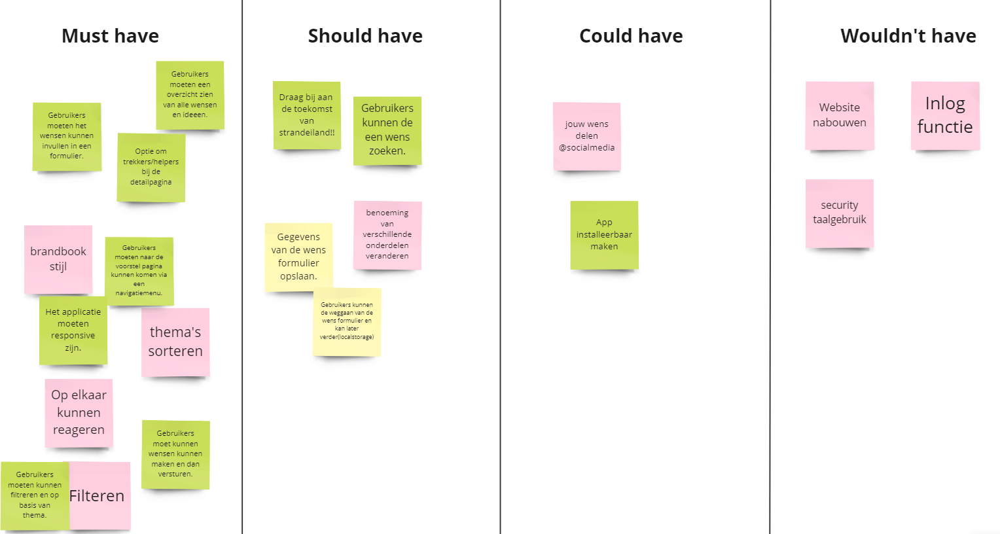

# Meesterproef - Duurzaam, groen en sociaal Strandeiland

- Team Repo: https://github.com/RainbowJM/strandeiland

---
## Inhoudsopgave
- [Meesterproef - Duurzaam, groen en sociaal Strandeiland](#meesterproef---duurzaam-groen-en-sociaal-strandeiland)
  - [Inhoudsopgave](#inhoudsopgave)
  - [Week 1: Debriefing en de eerste iteratie](#week-1-debriefing-en-de-eerste-iteratie)
  - [Opdrachtomschrijving](#opdrachtomschrijving)
  - [User stories](#user-stories)
  - [Voor de briefing](#voor-de-briefing)
    - [Mindmap](#mindmap)
  - [De briefing](#de-briefing)
- [Ideegeneratie](#ideegeneratie)
  - [Requirements lijst en brainstorm sessie](#requirements-lijst-en-brainstorm-sessie)
  - [Visuele analyse](#visuele-analyse)
  - [Schetsen overzichtpagina's](#schetsen-overzichtpaginas)
  - [Overzichtpagina eerste versie op Figma](#overzichtpagina-eerste-versie-op-figma)
    - [Versie 1:](#versie-1)
    - [Versie 2:](#versie-2)
  - [Overzichtpagina op code](#overzichtpagina-op-code)
    - [Versie 1:](#versie-1-1)
    - [Versie 2:](#versie-2-1)
- [Feedback week 1](#feedback-week-1)
  - [31 mei 2023: Feedback design review](#31-mei-2023-feedback-design-review)
  - [1 juni 2023: Feedback debriefing](#1-juni-2023-feedback-debriefing)
  - [2 juni 2023:  Testen met opdrachtgever iteratie 1 -](#2-juni-2023--testen-met-opdrachtgever-iteratie-1--)
  - [Reflectie](#reflectie)
  - [Wat gaan we volgende week doen?](#wat-gaan-we-volgende-week-doen)
  - [Week 2: Filter functionaliteit](#week-2-filter-functionaliteit)
  - [Filter schetsen variaties](#filter-schetsen-variaties)
---

## Week 1: Debriefing en de eerste iteratie
Deze week begonnen we met een kick-off presentatie van het eindproject voor deze Minor. We kregen gedetailleerde informatie over het geplande schema voor de komende vijf weken. Verder hebben we een eerste iteratie aangewerkt van ons prototype. Voor deze week wilde we een eerste versie van de overzichtpagina, detailpagina maak een wens formulier. Ik ben aan de slag geweest met het uitwerken van de overzichtpagina. 

## Opdrachtomschrijving

## User stories

## Voor de briefing
Verder hadden we een eerste ontmoeting met Michel Vogler van CrossmarX. Voordat we de briefing kregen hebben we een mindmap gemaakt met alle informatie die we al hadden over het project. Deze mindmap vind je hieronder.

### Mindmap

Hieronder vind je de vragen die we hebben gesteld aan Michel Vogler:
1. Wat wil de opdrachtgever met deze opdracht?
1. Eigen repo op github of repo van het bedrijf zelf? (vanuit school moet github)
1. Prototype start from scratch? 
1. Wat is de doelstelling?
1. Wat zijn de randvoorwaarden?
1. Heeft het project relatie met een andere project?
1. Voor desktop alleen? of desktop en mobile?
1. Hosten jullie het zelf?
1. Is er al een design? Is er een huisstijl? Is de huisstijl van de hello strandeiland?
1. Moet het een progressive web app worden? (zodat de app downloadbaar is)
1. Hoe moeten de voorstellen eruit komen te zien? Moet het een soort document worden of tekst met eventueel een afbeelding?
1. Hoe ziet u het onderdeel van de projectmanager voor zich? Bewoners en projectmanager een account of alleen projectmanager een account.
1. Zijn er specifieke thema’s, zoals lagere ecologische footprint en betere sociale cohesie van de wijk of moeten gebruikers deze zelf aan kunnen maken bij het voorstel?
1. Wanneer er meerdere voorstellen zijn geüpload, wilt u deze dan op een pagina zien waar u kunt filteren of onder verschillende tabbladen wilt met de verschillende thema’s?
1. In hoeverre verschilt dit project met hallostrandeiland.nl, aangezien je daar ook berichten hebt waar je een reactie bij kan plaatsen?
1. Hebben jullie het logo en beeldmateriaal, zodat wij dit kunnen gebruiken?

## De briefing
Na de briefing met de opdrachtgever hebben we een debriefing geschreven met ze allen en weer naar de opdrachtgever gestuurd. Hieronder is de link van ons debriefing.

- [https://github.com/RainbowJM/strandeiland/wiki/Debriefing](https://github.com/RainbowJM/strandeiland/wiki/Debriefing)

---
# Ideegeneratie
## Requirements lijst en brainstorm sessie

Hieronder zijn een aantal eisen die het product hebben:
- Er is een overzichtpagina waar gebruiker een overzicht van all wensen kan zien.
- Gebruikers kan filtreren op basis van populariteit, oudheid en thema.
- Gebruikers moeten zelf een voorstel kunnen aanmaken met behulp van wens maken formulier.
-  Het voorstel formulier opstellen op loclstorage
-  Een real time chat waar gebruikers met elkaar kunnen praten.

## Visuele analyse
Verder heb ik gewerkt aan de visuele analyse van de brand boek die we hadden gekregen van de opdrachtever. De reden waarom ik een visuel analyse heb gemaakt is omdat wij als groep een beeld kan krijgen welke beeldelementen moet we gebruiken op het protptype. Op de visuele analyse staan de volgende onderdelen:

- Typografie
- Kleurpalette en kleurcodes
- site componenten
- navigatiemenu
- call to action button

## Schetsen overzichtpagina's
Voor deze week zijn we begonnen met de idee generatie van het concept. Ik heb als taak gekregen om aan de slag te gaan met de overzichtpagina. Ik heb op mijn tekentablet, een paar schetsen gemaakt van de overzichtpagina. Hieronder staat een aantal schetsen die ik heb gemaakt van de overzichtpagina.

## Overzichtpagina eerste versie op Figma
Daarna ben ik meteen begonnen  met de eerste uitwerking van de overzichtpagina op prototype

### Versie 1:
Dit is mijn eerste versie die ik op figma heb gemaakt. Ik heb eerste de navigatiemnu nagemaakt van de strandeiland website. Want de opdrachtgever zei dat we alleen een nieuwe pagina moet toevoegen. En niet from scratch beginnen. Verder hebben we een slogan bedacht voor de wensen pagina, om het wat aantrekkelijker te maken. De layout hier is een grid van twee kolommen. En helemaal aan de rechterkan staat een onderdeel met de recente gemaakte wensen. Dus het wordt ook real time bijgehouden. 

### Versie 2:
In de tweede figma versie, heb ik andere layou stijl gemaakt. Bovenaan heb je een slideshow met populaire wensen. Maar de opdrachtgever gaf als feedback dat als je de populairste wensen bovenop zet worden ze populairder altijd on top en andere wensen worden in de achtergrond gebleven. Hij wil dat alle wensen 

## Overzichtpagina op code

### Versie 1:

### Versie 2:

---
# Feedback week 1

## 31 mei 2023: Feedback design review
- Meer interactie geven
- Meer afwijken van de huisstijl
- Overleg of de chat echt nuttig is
- Elk thema een kleur geven
- De detailpagina met bepaalde thema een kleur geven
- Animatie bij de slogan

## 1 juni 2023: Feedback debriefing 
We hebben ons eerste versie van de debrief gestuurd aan ons coach en de opdrachtgever. We hebben feedback gekegen die we hebben samen aangepast. Hier is de nieuwe versie van de debriefing:

Hier is een lijst met de feedback:
- Hebben we toegang tot het platform CrossMarX? Is dat nodig? 
- Is er content/data beschikbaar?
- Hoe gaan IJburg bewoners op het platform? Voornamelijk Mobiel? Responsive?
- Hoe krijgt de gemeente en projectleiders de ideeen en voorstellen te zien/horen?
- Hebben we een huisstijldocument? Of moeten we dat samenstellen aan de hand van de bestaande website
- Is de huisstijlgids grafisch of zijn er al web elementen en componenten gedefinieerd (living styleguide)?
- Kunnen we inlog testen? Hebben we test user accounts? Is dat nodig?
- Hebben we toegang tot de gebruikers? Testdagen plannen? (liefst door de opdrachtgever)
- Projectleiders ontbreken in de lijst gebruikers?
- Welke data kunnen/willen de bewoners posten? titel, text, categorie, platje, filmpje? 
- Wat betekent API (vanuit school)? Wie gaat dat doen?
- Ik zie niet goed wat de relatie is tussen het project wat jullie gaan ontwerpen en maken en de CrossmarX software

## 2 juni 2023:  Testen met opdrachtgever iteratie 1 -
- We kunnen de thema bepalen met sustainability development goals of Donut economics
- Andere woorden voor trekkers en delers kunnen zijn; ambassadeur, steunen
- Overzicht van de mensen die de voorstel delen
- Kan wel met de huisstijl afwjken, moet wel strandeland gevoel uiten
- Kan je zien wie online is in de chat
- beetje ingewikkeld over chat, het kan misschien te veel worden, hij wilt echt de belangrijke berichten terug zien.
- meerdere thema's kunnen selecteren in het formulier
- hij wilt de chat zien en ook berichten zien (belangrijke berichten)
- aparte pagina maken waar je de chat apart op een pagina zet
- thema's moeten geod bekeken worden, strandeiland bestaat nog niet, dus speeltuin etc gaat niet handig zijn
- alle dingen die fout gaan op dit moment, die kun je vooraf voorkomen, zulke wensen wilt hij zien

## Reflectie
Deze week is voorbij, we hebben een debrief geschreven en al aan de opdrachtgever gestuurd. Verder heb wel op senlle manier iets samengesteld zodat wij aan de opdrachtgever kon presenteren. Ik moet wel zeggen dat ik mischien meer tijd moet besteden aan het schetsen van bepaalde functionaliteiten, om wat variaties toe te brengen. Verder denk ik wel dat we een beetje uniform moet werken qua code, want iedereen heeft een andere stijl. Dus volgende week ga ik een voorstel geven om linters te gebruiken. 

Verder denk ik wel dat wij als groep goed samenwerken, en er is duidelijke communicatie en taakverdeleling. oor volgende week moeten we bespreken welke nieuwe dingen willen we leren. Want tot nu toe doen we allemaal wat we al goed in bent. 

---

## Wat gaan we volgende week doen?
- filter menu afmaken
- wens maken button aanmaken
- schetsen maken van de filter
- schetsen maken van ui stack
- reflectie schrijven

---
## Week 2: Filter functionaliteit
In deze week hadden we een ons eerste standup met de coach. Hier besproken we wat we allemaal de vorige week hebben gedaan. Na de coach sessie hebben we een in ons groepje de taken verdeeld

## Filter schetsen variaties 

